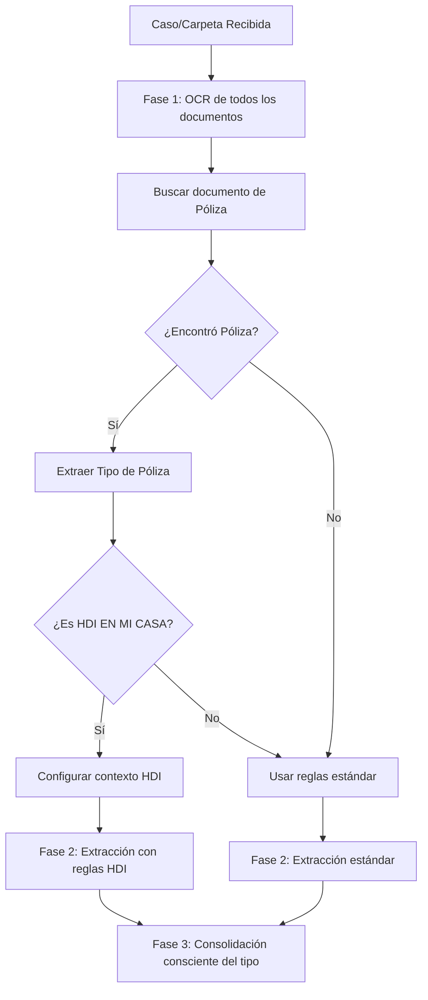

# Guía de Implementación: Soporte para Pólizas HDI EN MI CASA

## Resumen Ejecutivo

Este documento detalla la implementación de soporte especial para pólizas tipo "HDI EN MI CASA", que requieren reglas de extracción diferenciadas debido a sus características particulares en cuanto a formato de datos y ubicación de campos.

**PUNTO CLAVE**: El sistema detecta el tipo de póliza AL INICIO del procesamiento del caso (después del OCR pero ANTES de cualquier extracción de campos). Esta detección temprana configura el contexto para TODO el proceso de extracción y consolidación posterior.

## Notas de Encaje con el Repositorio (v2 guiado)

- El pipeline actual usa extracción guiada (`extract_from_document_guided`) con mapeos estrictos por tipo de documento (`DOCUMENT_FIELD_MAPPING`).
- Para evitar que la máscara de campos anule valores válidos, se deben ajustar los mapeos y/o hacerlos conscientes del contexto de póliza (HDI) antes de extraer.
- El lugar correcto para insertar la detección del tipo de póliza es dentro de `scripts/run_report.py`, método `FraudAnalysisSystemV2._process_with_ai`, justo DESPUÉS del OCR y ANTES de la "FASE 2: Extracción".

## Cambios Requeridos

### 1. Número de Siniestro Variable
- **Actual**: 14 dígitos exactos
- **HDI EN MI CASA**: Formato variable (ej: "3925/25 R - 4735611")

### 2. Campo Ubicación del Riesgo
- Añadir búsqueda en "UBICACIÓN DEL RIESGO" para `lugar_hechos`.
- Recomendado: permitir `lugar_hechos` desde póliza SOLO bajo contexto HDI para no abrir el campo global sin control.

### 3. Nuevo Ajustador
- Añadir "NUÑEZ MORA Y ASOCIADOS AJUSTADORES" a la lista de ajustadores reconocidos

### 4. Tipo de Siniestro en Informe Final
- Para HDI EN MI CASA: extraer de texto narrativo en informe_final_del_ajustador
- Buscar patrones como "Daños a Equipo Electrónico por Variación de Voltaje"

### 5. Detección de Tipo de Póliza
- Analizar campo "tipo de póliza" antes de la extracción
- Si contiene "HDI EN MI CASA" → aplicar reglas especiales

## Arquitectura de la Solución

### Flujo de Procesamiento

**IMPORTANTE**: La detección del tipo de póliza DEBE ocurrir AL INICIO del procesamiento del caso, ANTES de iniciar cualquier extracción de campos.



### Punto de Integración Principal

El sistema detecta el tipo de póliza **DESPUÉS del OCR pero ANTES de la extracción de campos**. En el código actual, esto se implementa dentro de `scripts/run_report.py`, método `FraudAnalysisSystemV2._process_with_ai`, inmediatamente antes del bloque de logs:

```
🔍 FASE 2: Extracción de campos con IA
```

## Implementación Detallada

### Fase 1: Detección del Tipo de Póliza

#### 1.1 Modificar `ai_field_extractor.py`

Añadir método para detectar tipo de póliza:

```python
import re
from typing import Dict, Any, Optional

def _get_text_content(self, ocr_result: Dict[str, Any]) -> str:
    """
    Extrae texto del resultado OCR de manera segura
    """
    if isinstance(ocr_result, dict):
        return ocr_result.get("text", "")
    elif hasattr(ocr_result, "text"):
        return getattr(ocr_result, "text", "")
    return ""

async def detect_policy_type(
    self,
    ocr_result: Dict[str, Any],
    document_type: str
) -> Optional[str]:
    """
    Detecta el tipo de póliza del documento
    Returns: 'HDI_EN_MI_CASA' | None
    """
    try:
        if document_type != "poliza_de_la_aseguradora":
            return None
        
        # Buscar en texto OCR
        text = self._get_text_content(ocr_result)
        
        # Búsqueda en key-value pairs
        kv_pairs = ocr_result.get("key_value_pairs", {})
        for key, value in kv_pairs.items():
            if "tipo" in key.lower() and "poliza" in key.lower():
                if "HDI EN MI CASA" in str(value).upper():
                    logger.info(f"Detectado HDI EN MI CASA en campo: {key}")
                    return "HDI_EN_MI_CASA"
        
        # Búsqueda en texto completo
        if "HDI EN MI CASA" in text.upper():
            # Verificar contexto para confirmar
            patterns = [
                r"tipo\s+de\s+p[oó]liza[:\s]+HDI\s+EN\s+MI\s+CASA",
                r"p[oó]liza\s+HDI\s+EN\s+MI\s+CASA"
            ]
            for pattern in patterns:
                if re.search(pattern, text, re.IGNORECASE):
                    logger.info(f"Detectado HDI EN MI CASA por patrón: {pattern}")
                    return "HDI_EN_MI_CASA"
        
        return None
        
    except Exception as e:
        logger.error(f"Error detectando tipo de póliza: {e}")
        return None  # En caso de error, usar reglas estándar
```

Nota: los métodos anteriores son miembros de la clase `AIFieldExtractor` (no funciones libres).

#### 1.2 Crear Configuración Específica en `settings.py`

Añadir nueva sección de configuración:

```python
# Configuración para tipos especiales de póliza
SPECIAL_POLICY_CONFIGS = {
    "HDI_EN_MI_CASA": {
        "numero_siniestro_pattern": r"[\d/]+\s*[R\-]\s*[\d]+",
        "numero_siniestro_validation": "flexible",
        "tipo_siniestro_source": "informe_final_del_ajustador",
        "tipo_siniestro_extraction": "narrative",
        "additional_field_sources": {
            "lugar_hechos": ["UBICACIÓN DEL RIESGO", "lugar_hechos"]
        }
    }
}

# Añadir a RECOGNIZED_ADJUSTERS
RECOGNIZED_ADJUSTERS = [
    "SINIESCA",
    "PARK PERALES",
    "NUÑEZ MORA Y ASOCIADOS AJUSTADORES"  # NUEVO
]
```

#### 1.3 Ajustes de Mapeo y Máscara

Para evitar que la máscara de campos anule valores válidos en HDI:

```python
# Añadir 'tipo_siniestro' al informe final (es fuente narrativa en HDI)
DOCUMENT_FIELD_MAPPING["informe_final_del_ajustador"].append("tipo_siniestro")

# Opción A (global): permitir 'lugar_hechos' desde póliza
# DOCUMENT_FIELD_MAPPING["poliza_de_la_aseguradora"].append("lugar_hechos")

# Opción B (recomendada): permitir dinámicamente solo bajo contexto HDI.
# Implementar en el extractor: si policy_context == 'HDI_EN_MI_CASA' y
# document_type == 'poliza_de_la_aseguradora', añadir 'lugar_hechos' a allowed_fields.
```

### Fase 2: Modificación del Sistema de Validación

#### 2.1 Actualizar `validators.py`

Crear validador flexible para número de siniestro y exponer el contexto de póliza en `FieldValidator`:

```python
class FieldValidator:
    def __init__(self):
        self.policy_type = None
        # ... resto de inicialización ...

    def set_policy_type(self, policy_type: Optional[str]):
        self.policy_type = policy_type

    def validate_field(self, field_name: str, value: Any) -> tuple[bool, Any, Optional[str]]:
        # ... lógica previa ...
        if field_name == "numero_siniestro" and self.policy_type == "HDI_EN_MI_CASA":
            return self.validate_numero_siniestro_flexible(value)
        # ... continuar con validación estándar ...

def validate_numero_siniestro_flexible(self, value: str) -> tuple[bool, str, Optional[str]]:
    """
    Validación flexible para números de siniestro HDI EN MI CASA
    Formato esperado: "3925/25 R - 4735611" o similar
    Patrón: XXXX/YY [LETRA] - NNNNNNN
    """
    if not value:
        return False, value, "Número de siniestro vacío"
    
    # Limpiar espacios extras
    cleaned = " ".join(value.split())
    
    # Patrón mejorado: más estricto pero flexible
    # Formato: 1-4 dígitos / 2 dígitos [letra opcional] - 7-8 dígitos
    pattern = r"^\d{1,4}/\d{2}\s*[A-Z]?\s*-\s*\d{7,8}$"
    
    if re.match(pattern, cleaned):
        return True, cleaned, None
    
    # Patrón alternativo para variaciones comunes
    alt_pattern = r"^\d{1,4}/\d{2}\s*[A-Z]?\s*[-–—]\s*\d{6,9}$"
    if re.match(alt_pattern, cleaned):
        # Normalizar guión
        cleaned = re.sub(r'[-–—]', '-', cleaned)
        return True, cleaned, None
    
    return False, value, f"Formato inválido para HDI EN MI CASA: {value}"
```

### Fase 3: Sistema de Extracción Contextual

#### 3.1 Crear Extractor Especializado en `extraction_prompts.py`

Añadir método para construcción de prompts HDI:

```python
def build_hdi_extraction_prompt(
    self,
    document_name: str,
    document_type: str,
    content: Dict[str, Any],
    policy_type: str = "HDI_EN_MI_CASA"
) -> str:
    """
    Construye prompt especializado para pólizas HDI EN MI CASA
    """
    base_prompt = f"""
Eres un especialista en extracción de datos de pólizas HDI EN MI CASA.
Estas pólizas tienen características especiales que debes considerar:

1. NÚMERO DE SINIESTRO:
   - NO tiene formato de 14 dígitos
   - Formato típico: "3925/25 R - 4735611"
   - Puede incluir barras, letras y guiones
   - Extrae el número COMPLETO tal como aparece

2. NOMBRE DEL ASEGURADO:
   - Buscar en tabla "el asegurado es" → campo "nombre"
   - También puede aparecer como "Contratante" o "Cliente"

3. LUGAR DE LOS HECHOS:
   - Prioridad 1: Campo "UBICACIÓN DEL RIESGO"
   - Prioridad 2: Campo tradicional "lugar_hechos"
   - Prioridad 3: "Domicilio del siniestro"

4. TIPO DE SINIESTRO (solo para informe_final_del_ajustador):
   - NO está en un campo estructurado
   - Buscar en el texto narrativo, especialmente en:
     * Primera página
     * Párrafo introductorio
     * Frases como "a causa del Siniestro de [TIPO]"
   - Ejemplo: "Daños a Equipo Electrónico por Variación de Voltaje"

DOCUMENTO: {document_name}
TIPO: {document_type}

CONTENIDO A ANALIZAR:
"""
    
    # Añadir contenido según tipo
    if document_type == "informe_final_del_ajustador":
        base_prompt += """
IMPORTANTE: Para el tipo de siniestro, busca en el texto narrativo.
Patrones comunes:
- "siniestro de [TIPO]"
- "pérdidas por [TIPO]"
- "daños causados por [TIPO]"
- "reclamación por [TIPO]"
"""
    
    # Añadir contenido OCR
    if content:
        base_prompt += f"\n{json.dumps(content, ensure_ascii=False, indent=2)}"
    
    base_prompt += """

RESPONDE SOLO CON UN JSON con los campos encontrados.
Si un campo no se encuentra, usa null.
NO inventes información.
"""
    
    return base_prompt
```

Alternativa integrada (recomendada): extender `build_guided_extraction_prompt` con `policy_type` para inyectar instrucciones HDI sin duplicar lógica.

```python
def build_guided_extraction_prompt(self, document_name, document_type, content=None, route="ocr_text", policy_type: Optional[str] = None) -> str:
    # ... obtener allowed_fields y construir guide_section ...
    if policy_type == "HDI_EN_MI_CASA":
        guide_section += """
INSTRUCCIONES HDI EN MI CASA:
- NÚMERO DE SINIESTRO: no es de 14 dígitos; puede ser como "3925/25 R - 4735611".
- LUGAR DE LOS HECHOS: en póliza usar "UBICACIÓN DEL RIESGO" como primera fuente.
- INFORME FINAL: extraer tipo de siniestro desde texto narrativo si no hay campo estructurado.
"""
    # ... continuar con prompt según route (visión/texto) ...
```

### Fase 4: Integración con el Flujo Principal en `run_report.py`

#### 4.1 Modificar `FraudAnalysisSystemV2._process_with_ai` en `scripts/run_report.py`

El punto crítico de integración es dentro del método `FraudAnalysisSystemV2._process_with_ai`, justo DESPUÉS del OCR pero ANTES de la extracción. Insertar el siguiente bloque antes de los logs de "FASE 2":

```python
# ============================================
# FASE 1.5: DETECCIÓN DE TIPO DE PÓLIZA (NUEVO)
# ============================================
logger.info("\n🔎 FASE 1.5: Detección de tipo de póliza")
logger.info("-" * 40)

policy_type = None
policy_document = None

# Feature flag check
if os.getenv("ENABLE_HDI_SPECIAL_RULES", "true").lower() == "true":
    # Buscar el documento de póliza en los resultados OCR
    for doc_data in ocr_results:
        filename_lower = doc_data["filename"].lower()
        
        # Detectar si es póliza por nombre o clasificación
        if any(term in filename_lower for term in ["poliza", "póliza", "policy"]):
            logger.info(f"  📋 Analizando póliza: {doc_data['filename']}")
            
            try:
                # Detectar tipo de póliza
                policy_type = await self.extractor.detect_policy_type(
                    doc_data["ocr_result"],
                    "poliza_de_la_aseguradora"
                )
                
                if policy_type == "HDI_EN_MI_CASA":
                    logger.info(f"  🏠 ¡DETECTADO! Tipo de póliza: HDI EN MI CASA")
                    policy_document = doc_data["filename"]
                    break
                else:
                    logger.info(f"  📄 Póliza estándar detectada")
                    
            except Exception as e:
                logger.error(f"  ❌ Error detectando tipo de póliza: {e}")
                policy_type = None

    # Configurar el contexto para todo el proceso
    if policy_type == "HDI_EN_MI_CASA":
        logger.info("  ⚡ Configurando reglas especiales para HDI EN MI CASA")
        
        # Verificar que los métodos existen antes de llamar
        if hasattr(self.extractor, 'set_policy_context'):
            self.extractor.set_policy_context(policy_type)
        else:
            logger.warning("Extractor no tiene método set_policy_context")
            
        if hasattr(self.consolidator, 'set_policy_context'):
            self.consolidator.set_policy_context(policy_type)
        else:
            logger.warning("Consolidator no tiene método set_policy_context")
    else:
        logger.info("  ✓ Usando reglas de extracción estándar")
else:
    logger.info("  ℹ️ Detección HDI deshabilitada por feature flag")
    policy_type = None

# ============================================
# FASE 2: Extracción con IA (MODIFICADA)
# ============================================
logger.info("\n🔍 FASE 2: Extracción de campos con IA")
logger.info("-" * 40)

# El resto del código continúa, pero ahora con el contexto de póliza configurado
```

#### 4.2 Modificar `AIFieldExtractor` (contexto y flujo guiado)

```python
def __init__(self, api_key: Optional[str] = None):
    # ... código existente ...
    self.policy_context = None  # NUEVO: contexto de póliza para todo el proceso
    self.policy_type_cache = {}  # NUEVO: cache de detección por caso
    
def set_policy_context(self, policy_type: str, case_id: Optional[str] = None):
    """Establece el contexto de póliza para todo el proceso de extracción"""
    self.policy_context = policy_type
    
    # Cachear resultado si se proporciona case_id
    if case_id:
        self.policy_type_cache[case_id] = policy_type
        
logger.info(f"Contexto de póliza establecido: {policy_type}")

# En el flujo guiado, inyectar el contexto en el validador y el prompt
async def extract_from_document_guided(...):
    # ... antes de construir el prompt ...
    if self.policy_context == "HDI_EN_MI_CASA":
        self.validator.set_policy_type(self.policy_context)
        prompt = self.prompt_builder.build_guided_extraction_prompt(
            document_name=document_name,
            document_type=document_type,
            content=content if route == "ocr_text" else None,
            route=route,
            policy_type=self.policy_context
        )
    else:
        prompt = self.prompt_builder.build_guided_extraction_prompt(
            document_name=document_name,
            document_type=document_type,
            content=content if route == "ocr_text" else None,
            route=route
        )

    # ... después de obtener los allowed_fields ...
    if self.policy_context == "HDI_EN_MI_CASA" and document_type == "poliza_de_la_aseguradora":
        # Permitir dinámicamente 'lugar_hechos' desde póliza bajo contexto HDI
        allowed_fields = list(set(allowed_fields + ["lugar_hechos"]))
    # ... continuar flujo guiado normal ...
```

### Fase 5: Propagación del Contexto de Póliza

#### 5.1 Modificar `AIConsolidator`

Añadir soporte para consolidación consciente del tipo de póliza:

```python
def __init__(self, api_key: Optional[str] = None):
    # ... código existente ...
    self.policy_context = None  # NUEVO: contexto de póliza
    self.custom_priorities = {}  # NUEVO: prioridades personalizadas

def set_policy_context(self, policy_type: str):
    """Establece el contexto de póliza para la consolidación"""
    self.policy_context = policy_type
    
    # Ajustar prioridades según tipo de póliza
    if policy_type == "HDI_EN_MI_CASA":
        # Para HDI, el tipo_siniestro viene del informe final (narrativo)
        # lugar_hechos puede venir de UBICACIÓN DEL RIESGO en la póliza
        self.custom_priorities = {
            "tipo_siniestro": ["informe_final_del_ajustador"],
            "incident_location": ["poliza_de_la_aseguradora", "informe_preliminar_del_ajustador"],
            "lugar_hechos": ["poliza_de_la_aseguradora", "informe_preliminar_del_ajustador"]  # Compatibilidad
        }
        logger.info("Prioridades de consolidación ajustadas para HDI EN MI CASA")

def apply_custom_priorities(self, field_name: str, extractions: List) -> Optional[Any]:
    """
    Aplica prioridades personalizadas para campos específicos
    """
    if field_name in self.custom_priorities:
        priority_docs = self.custom_priorities[field_name]
        for doc_type in priority_docs:
            for extraction in extractions:
                if extraction.document_type == doc_type:
                    value = extraction.extracted_fields.get(field_name)
                    if value and str(value).strip():
                        logger.info(f"Usando valor prioritario para {field_name} desde {doc_type}: {value}")
                        return value
    return None

async def consolidate_extractions(
    self,
    extractions: List[DocumentExtraction],
    case_id: str,
    use_advanced_reasoning: bool = True,
    guided_mode: bool = True
) -> ConsolidatedExtraction:
    """
    Consolida con conocimiento del tipo de póliza
    """
    logger.info(f"Consolidando {len(extractions)} extracciones para caso {case_id}")
    
    # NUEVO: Log del contexto de póliza
    if self.policy_context:
        logger.info(f"🏠 Usando contexto de póliza: {self.policy_context}")
    
    # Si hay prioridades personalizadas, aplicarlas
    if self.custom_priorities:
        # Aplicar lógica de prioridades personalizadas aquí
        logger.info("Aplicando prioridades personalizadas de consolidación")
    
    # ... resto del código de consolidación ...
```

### Fase 6: Extracción de Tipo de Siniestro Narrativo

#### 6.1 Crear Extractor Especializado

```python
async def extract_incident_type_from_narrative(
    self,
    text: str,
    document_type: str
) -> Optional[str]:
    """
    Extrae tipo de siniestro de texto narrativo
    Específico para informes de ajustador HDI EN MI CASA
    """
    if document_type != "informe_final_del_ajustador":
        return None
    
    prompt = """
    Analiza el siguiente texto y extrae el TIPO DE SINIESTRO mencionado.
    
    Busca frases como:
    - "siniestro de [TIPO]"
    - "pérdidas sufridas por [TIPO]"
    - "ajuste de [TIPO]"
    - "daños por [TIPO]"
    
    Texto a analizar:
    {text}
    
    Responde SOLO con el tipo de siniestro encontrado o null si no lo encuentras.
    Ejemplos válidos:
    - "Daños a Equipo Electrónico por Variación de Voltaje"
    - "Robo con Violencia"
    - "Incendio"
    
    Tu respuesta:
    """
    
    response = await self.client.chat.completions.create(
        model="gpt-4o-mini",
        messages=[
            {"role": "system", "content": "Eres un experto en análisis de documentos de seguros."},
            {"role": "user", "content": prompt.format(text=text[:2000])}  # Limitar texto
        ],
        temperature=0.1,
        max_completion_tokens=100
    )
    
    tipo_siniestro = response.choices[0].message.content.strip()
    
    # Validar que no sea una respuesta genérica
    if tipo_siniestro and tipo_siniestro.lower() not in ["null", "none", "no encontrado"]:
        return tipo_siniestro
    
    return None
```

### Fase 7: Evitar enmascarado por mapeo de campos

- Asegurar que `DOCUMENT_FIELD_MAPPING["informe_final_del_ajustador"]` incluya `"tipo_siniestro"`.
- Permitir `"lugar_hechos"` desde `poliza_de_la_aseguradora` SOLO bajo contexto HDI (ver Fase 4.2) o habilitarlo globalmente si el negocio lo aprueba.

## Plan de Testing Completo

### Estructura de Tests

Los tests deben organizarse en la siguiente estructura:
```
tests/
├── unit/
│   ├── test_hdi_policy_detection.py
│   ├── test_hdi_field_validation.py
│   ├── test_hdi_extraction_prompts.py
│   └── test_hdi_narrative_extraction.py
├── integration/
│   ├── test_hdi_full_pipeline.py
│   ├── test_hdi_consolidation.py
│   └── test_mixed_policy_types.py
├── fixtures/
│   ├── hdi_documents/
│   │   ├── poliza_hdi_en_mi_casa.json
│   │   ├── informe_preliminar_hdi.json
│   │   └── informe_final_hdi.json
│   └── standard_documents/
│       └── poliza_transporte.json
└── conftest.py
```

### Tests Unitarios Detallados

#### 1. Test de Detección de Tipo de Póliza (`test_hdi_policy_detection.py`)

```python
import pytest
from unittest.mock import Mock, patch
from fraud_scorer.processors.ai.ai_field_extractor import AIFieldExtractor

class TestHDIPolicyDetection:
    """Tests para la detección del tipo de póliza HDI EN MI CASA"""
    
    @pytest.fixture
    def extractor(self):
        return AIFieldExtractor()
    
    @pytest.mark.asyncio
    async def test_detect_hdi_in_key_value_pairs(self, extractor):
        """Test: Detecta HDI EN MI CASA en pares clave-valor"""
        ocr_result = {
            "text": "PÓLIZA DE SEGURO HOGAR",
            "key_value_pairs": {
                "Tipo de Póliza": "HDI EN MI CASA",
                "Número de Póliza": "HDI-2024-001"
            }
        }
        
        policy_type = await extractor.detect_policy_type(
            ocr_result, 
            "poliza_de_la_aseguradora"
        )
        
        assert policy_type == "HDI_EN_MI_CASA"
    
    @pytest.mark.asyncio
    async def test_detect_hdi_in_text_with_variations(self, extractor):
        """Test: Detecta HDI EN MI CASA con variaciones de texto"""
        test_cases = [
            "TIPO DE PÓLIZA: HDI EN MI CASA",
            "Póliza HDI EN MI CASA",
            "tipo de poliza: HDI EN MI CASA",
            "PÓLIZA HDI EN MI CASA - HOGAR"
        ]
        
        for text_case in test_cases:
            ocr_result = {
                "text": f"DOCUMENTO DE SEGURO\n{text_case}\nVigencia 2024",
                "key_value_pairs": {}
            }
            
            policy_type = await extractor.detect_policy_type(
                ocr_result, 
                "poliza_de_la_aseguradora"
            )
            
            assert policy_type == "HDI_EN_MI_CASA", f"Failed for text: {text_case}"
    
    @pytest.mark.asyncio
    async def test_no_detection_for_standard_policies(self, extractor):
        """Test: NO detecta HDI para pólizas estándar"""
        standard_policies = [
            {"text": "PÓLIZA DE TRANSPORTE", "key_value_pairs": {"Tipo": "Transporte"}},
            {"text": "SEGURO DE AUTOMÓVIL", "key_value_pairs": {"Tipo": "Auto"}},
            {"text": "PÓLIZA EMPRESARIAL", "key_value_pairs": {}},
        ]
        
        for ocr_result in standard_policies:
            policy_type = await extractor.detect_policy_type(
                ocr_result, 
                "poliza_de_la_aseguradora"
            )
            assert policy_type is None
    
    @pytest.mark.asyncio
    async def test_detection_only_for_policy_documents(self, extractor):
        """Test: Solo detecta en documentos tipo póliza"""
        ocr_result = {
            "text": "HDI EN MI CASA",
            "key_value_pairs": {"Info": "HDI EN MI CASA"}
        }
        
        # No debe detectar en otros tipos de documentos
        for doc_type in ["factura", "carta_reclamacion", "informe_preliminar"]:
            policy_type = await extractor.detect_policy_type(ocr_result, doc_type)
            assert policy_type is None
```

#### 2. Test de Validación de Campos HDI (`test_hdi_field_validation.py`)

```python
import pytest
from fraud_scorer.utils.validators import FieldValidator

class TestHDIFieldValidation:
    """Tests para validación de campos específicos de HDI"""
    
    @pytest.fixture
    def validator(self):
        validator = FieldValidator()
        validator.set_policy_type("HDI_EN_MI_CASA")
        return validator
    
    def test_validate_hdi_claim_numbers(self, validator):
        """Test: Valida números de siniestro con formato HDI"""
        valid_cases = [
            ("3925/25 R - 4735611", True, "Formato estándar HDI"),
            ("1234/24 - 9876543", True, "Sin letra intermedia"),
            ("5678/25 A - 1234567", True, "Con letra A"),
            ("999/23 B-7654321", True, "Sin espacios en guión"),
            ("1/25 - 1", True, "Números mínimos"),
        ]
        
        for number, should_pass, description in valid_cases:
            is_valid, cleaned, error = validator.validate_field(
                "numero_siniestro", 
                number
            )
            assert is_valid == should_pass, f"Failed for {description}: {number}"
            if is_valid:
                assert cleaned is not None
                assert error is None
    
    def test_reject_invalid_hdi_claim_numbers(self, validator):
        """Test: Rechaza números de siniestro inválidos para HDI"""
        invalid_cases = [
            ("12345678901234", "14 dígitos sin formato HDI"),
            ("ABC/25 - XYZ", "Letras en lugar de números"),
            ("", "Vacío"),
            ("3925 25 R 4735611", "Sin separadores correctos"),
            ("3925/25/R/4735611", "Demasiadas barras"),
        ]
        
        for number, description in invalid_cases:
            is_valid, _, error = validator.validate_field(
                "numero_siniestro", 
                number
            )
            assert not is_valid, f"Should reject {description}: {number}"
            assert error is not None
    
    def test_standard_validation_when_not_hdi(self):
        """Test: Usa validación estándar cuando no es HDI"""
        validator = FieldValidator()  # Sin tipo de póliza
        
        # Debe validar formato de 14 dígitos
        is_valid, cleaned, _ = validator.validate_field(
            "numero_siniestro",
            "12345678901234"
        )
        assert is_valid
        assert cleaned == "12345678901234"
        
        # Debe rechazar formato HDI
        is_valid, _, _ = validator.validate_field(
            "numero_siniestro",
            "3925/25 R - 4735611"
        )
        assert not is_valid
```

#### 3. Test de Prompts de Extracción HDI (`test_hdi_extraction_prompts.py`)

```python
import pytest
from fraud_scorer.prompts.extraction_prompts import ExtractionPromptBuilder

class TestHDIExtractionPrompts:
    """Tests para construcción de prompts específicos de HDI"""
    
    @pytest.fixture
    def prompt_builder(self):
        return ExtractionPromptBuilder()
    
    def test_hdi_prompt_includes_special_instructions(self, prompt_builder):
        """Test: Prompt HDI incluye instrucciones especiales"""
        prompt = prompt_builder.build_hdi_extraction_prompt(
            document_name="poliza_123.pdf",
            document_type="poliza_de_la_aseguradora",
            content={"text": "Contenido de prueba"},
            policy_type="HDI_EN_MI_CASA"
        )
        
        # Verificar instrucciones clave
        assert "HDI EN MI CASA" in prompt
        assert "NO tiene formato de 14 dígitos" in prompt
        assert "3925/25 R - 4735611" in prompt  # Ejemplo de formato
        assert "UBICACIÓN DEL RIESGO" in prompt
        assert "el asegurado es" in prompt
    
    def test_hdi_prompt_for_final_report(self, prompt_builder):
        """Test: Prompt especial para informe final HDI"""
        prompt = prompt_builder.build_hdi_extraction_prompt(
            document_name="informe_final.pdf",
            document_type="informe_final_del_ajustador",
            content={"text": "Informe final"},
            policy_type="HDI_EN_MI_CASA"
        )
        
        # Debe incluir instrucciones para extracción narrativa
        assert "tipo de siniestro" in prompt.lower()
        assert "texto narrativo" in prompt.lower()
        assert "siniestro de [TIPO]" in prompt
        assert "NO está en un campo estructurado" in prompt
    
    def test_prompt_adapts_to_document_type(self, prompt_builder):
        """Test: Prompt se adapta según tipo de documento"""
        doc_types = [
            "poliza_de_la_aseguradora",
            "informe_preliminar_del_ajustador",
            "informe_final_del_ajustador"
        ]
        
        prompts = {}
        for doc_type in doc_types:
            prompts[doc_type] = prompt_builder.build_hdi_extraction_prompt(
                document_name=f"{doc_type}.pdf",
                document_type=doc_type,
                content={"text": "Test"},
                policy_type="HDI_EN_MI_CASA"
            )
        
        # Cada prompt debe ser único
        assert len(set(prompts.values())) == len(doc_types)
        
        # El prompt del informe final debe ser diferente
        assert len(prompts["informe_final_del_ajustador"]) != len(prompts["poliza_de_la_aseguradora"])
```

#### 4. Test de Extracción Narrativa (`test_hdi_narrative_extraction.py`)

```python
import pytest
from fraud_scorer.processors.ai.ai_field_extractor import AIFieldExtractor

class TestHDINarrativeExtraction:
    """Tests para extracción de campos desde texto narrativo"""
    
    @pytest.fixture
    def extractor(self):
        return AIFieldExtractor()
    
    @pytest.mark.asyncio
    async def test_extract_incident_type_from_standard_text(self, extractor):
        """Test: Extrae tipo de siniestro de texto estándar"""
        text = """
        Muy señores nuestros:
        
        Junto con la presente les estamos enviando el Informe correspondiente al
        Ajuste de las pérdidas sufridas por su Asegurado a causa del
        Siniestro de Daños a Equipo Electrónico por Variación de Voltaje, cuyo cálculo
        se sirvieron ustedes encomendarnos.
        """
        
        tipo = await extractor.extract_incident_type_from_narrative(
            text, 
            "informe_final_del_ajustador"
        )
        
        assert tipo == "Daños a Equipo Electrónico por Variación de Voltaje"
    
    @pytest.mark.asyncio
    async def test_extract_various_incident_types(self, extractor):
        """Test: Extrae diferentes tipos de siniestro"""
        test_cases = [
            (
                "reclamación por Robo con Violencia en Casa Habitación",
                "Robo con Violencia en Casa Habitación"
            ),
            (
                "pérdidas causadas por Incendio en Casa Habitación",
                "Incendio en Casa Habitación"
            ),
            (
                "daños por Fenómenos Hidrometeorológicos registrados",
                "Fenómenos Hidrometeorológicos"
            ),
        ]
        
        for text_snippet, expected_type in test_cases:
            full_text = f"Estimados señores:\n\n{text_snippet}\n\nAtentamente,"
            
            tipo = await extractor.extract_incident_type_from_narrative(
                full_text,
                "informe_final_del_ajustador"
            )
            
            assert expected_type in tipo or tipo in expected_type, \
                f"Expected '{expected_type}' but got '{tipo}'"
    
    @pytest.mark.asyncio
    async def test_return_none_when_no_incident_type(self, extractor):
        """Test: Retorna None cuando no encuentra tipo de siniestro"""
        text = """
        Estimados señores:
        
        Adjunto encontrarán el informe solicitado con los detalles
        de la evaluación realizada en la propiedad asegurada.
        
        Saludos cordiales.
        """
        
        tipo = await extractor.extract_incident_type_from_narrative(
            text,
            "informe_final_del_ajustador"
        )
        
        assert tipo is None
```

### Tests de Integración Expandidos

#### 1. Test de Pipeline Completo HDI (`test_hdi_full_pipeline.py`)

```python
import pytest
import asyncio
from pathlib import Path
from scripts.run_report import FraudAnalysisSystemV2

class TestHDIFullPipeline:
    """Tests de integración para el pipeline completo con pólizas HDI"""
    
    @pytest.fixture
    async def fraud_system(self):
        system = FraudAnalysisSystemV2(guided_mode=True)
        yield system
        # Cleanup
        system.reset_cancellation()
    
    @pytest.mark.asyncio
    async def test_complete_hdi_case_processing(self, fraud_system, tmp_path):
        """Test: Procesa caso completo con póliza HDI EN MI CASA"""
        # Preparar carpeta de caso
        case_folder = tmp_path / "HDI_TEST_CASE"
        case_folder.mkdir()
        
        # Copiar fixtures a carpeta temporal
        fixtures = [
            "tests/fixtures/hdi_documents/poliza_hdi_en_mi_casa.pdf",
            "tests/fixtures/hdi_documents/informe_preliminar_hdi.pdf",
            "tests/fixtures/hdi_documents/informe_final_hdi.pdf",
        ]
        
        for fixture in fixtures:
            shutil.copy(fixture, case_folder)
        
        # Procesar caso
        output_path = tmp_path / "output"
        results = await fraud_system.process_case(
            folder_path=case_folder,
            output_path=output_path,
            case_title="Test HDI EN MI CASA"
        )
        
        # Verificaciones
        assert results["status"] == "completed"
        assert results["policy_type"] == "HDI_EN_MI_CASA"
        
        # Verificar campos consolidados
        consolidated = results["consolidated_extraction"]
        assert "3925/25" in consolidated.numero_siniestro
        assert "Daños a Equipo Electrónico" in consolidated.tipo_siniestro
        
        # Verificar que se usaron reglas especiales
        assert "HDI_DETECTION" in results["process_logs"]
        assert "HDI_EXTRACTION" in results["process_logs"]
    
    @pytest.mark.asyncio
    async def test_early_policy_detection(self, fraud_system):
        """Test: Detecta tipo de póliza ANTES de extracción"""
        # Mock para interceptar el flujo
        detection_order = []
        
        original_detect = fraud_system.extractor.detect_policy_type
        async def track_detection(*args, **kwargs):
            detection_order.append("detect_policy")
            return await original_detect(*args, **kwargs)
        
        original_extract = fraud_system.extractor.extract_from_document
        async def track_extraction(*args, **kwargs):
            detection_order.append("extract_fields")
            return await original_extract(*args, **kwargs)
        
        fraud_system.extractor.detect_policy_type = track_detection
        fraud_system.extractor.extract_from_document = track_extraction
        
        # Procesar caso
        await fraud_system.process_case(
            folder_path=Path("tests/fixtures/hdi_case"),
            output_path=Path("/tmp/output")
        )
        
        # Verificar orden: detección ANTES que extracción
        assert detection_order.index("detect_policy") < detection_order.index("extract_fields")
```

#### 2. Test de Consolidación HDI (`test_hdi_consolidation.py`)

```python
import pytest
from fraud_scorer.processors.ai.ai_consolidator import AIConsolidator
from fraud_scorer.models.extraction import DocumentExtraction

class TestHDIConsolidation:
    """Tests para consolidación con contexto HDI"""
    
    @pytest.fixture
    def consolidator(self):
        consolidator = AIConsolidator()
        consolidator.set_policy_context("HDI_EN_MI_CASA")
        return consolidator
    
    @pytest.mark.asyncio
    async def test_hdi_priority_for_incident_type(self, consolidator):
        """Test: Prioriza informe final para tipo de siniestro en HDI"""
        # Crear extracciones mock
        extractions = [
            DocumentExtraction(
                source_document="informe_preliminar.pdf",
                document_type="informe_preliminar_del_ajustador",
                extracted_fields={
                    "tipo_siniestro": "Daño genérico"  # No debe usar este
                }
            ),
            DocumentExtraction(
                source_document="informe_final.pdf",
                document_type="informe_final_del_ajustador",
                extracted_fields={
                    "tipo_siniestro": "Daños a Equipo Electrónico por Variación de Voltaje"
                }
            )
        ]
        
        # Consolidar
        result = await consolidator.consolidate_extractions(
            extractions=extractions,
            case_id="TEST_HDI_001"
        )
        
        # Debe priorizar el valor del informe final
        assert result.consolidated_fields.tipo_siniestro == \
               "Daños a Equipo Electrónico por Variación de Voltaje"
    
    @pytest.mark.asyncio
    async def test_hdi_ubicacion_riesgo_priority(self, consolidator):
        """Test: Usa UBICACIÓN DEL RIESGO como lugar_hechos"""
        extractions = [
            DocumentExtraction(
                source_document="poliza.pdf",
                document_type="poliza_de_la_aseguradora",
                extracted_fields={
                    "lugar_hechos": "Calle Example 123, CDMX",  # De UBICACIÓN DEL RIESGO
                    "domicilio_poliza": "Av. Principal 456"
                }
            )
        ]
        
        result = await consolidator.consolidate_extractions(
            extractions=extractions,
            case_id="TEST_HDI_002"
        )
        
        assert result.consolidated_fields.lugar_hechos == "Calle Example 123, CDMX"
```

#### 3. Test de Casos Mixtos (`test_mixed_policy_types.py`)

```python
class TestMixedPolicyTypes:
    """Tests para verificar que pólizas normales no se afectan"""
    
    @pytest.mark.asyncio
    async def test_standard_policy_uses_standard_rules(self, fraud_system):
        """Test: Póliza estándar usa reglas estándar"""
        # Procesar caso con póliza de transporte
        results = await fraud_system.process_case(
            folder_path=Path("tests/fixtures/standard_case"),
            output_path=Path("/tmp/output")
        )
        
        # No debe detectar HDI
        assert results.get("policy_type") != "HDI_EN_MI_CASA"
        
        # Debe validar número de siniestro con 14 dígitos
        assert len(results["consolidated_extraction"].numero_siniestro) == 14
        assert results["consolidated_extraction"].numero_siniestro.isdigit()
    
    @pytest.mark.asyncio
    async def test_batch_with_mixed_policies(self):
        """Test: Procesa lote con pólizas HDI y estándar"""
        cases = [
            ("HDI_CASE_001", "HDI_EN_MI_CASA", "3925/25 R - 4735611"),
            ("TRANSPORT_CASE_001", None, "12345678901234"),
            ("HDI_CASE_002", "HDI_EN_MI_CASA", "1234/24 - 9876543"),
        ]
        
        for case_id, expected_type, expected_claim in cases:
            system = FraudAnalysisSystemV2()
            results = await system.process_case(
                folder_path=Path(f"tests/fixtures/{case_id}"),
                output_path=Path("/tmp/output")
            )
            
            assert results.get("policy_type") == expected_type
            assert results["consolidated_extraction"].numero_siniestro == expected_claim
```

### Tests de Rendimiento y Edge Cases

```python
class TestHDIPerformance:
    """Tests de rendimiento y casos límite"""
    
    @pytest.mark.asyncio
    async def test_detection_performance(self):
        """Test: Detección de póliza no añade más de 200ms"""
        import time
        
        extractor = AIFieldExtractor()
        ocr_result = {"text": "PÓLIZA HDI EN MI CASA", "key_value_pairs": {}}
        
        start = time.time()
        await extractor.detect_policy_type(ocr_result, "poliza_de_la_aseguradora")
        elapsed = (time.time() - start) * 1000
        
        assert elapsed < 200, f"Detection took {elapsed}ms, expected < 200ms"
    
    @pytest.mark.asyncio
    async def test_handle_missing_policy_document(self, fraud_system):
        """Test: Maneja casos sin documento de póliza"""
        # Caso sin póliza
        results = await fraud_system.process_case(
            folder_path=Path("tests/fixtures/case_without_policy"),
            output_path=Path("/tmp/output")
        )
        
        # Debe usar reglas estándar
        assert results.get("policy_type") is None
        assert "standard_rules" in results["process_logs"]
    
    @pytest.mark.asyncio
    async def test_handle_corrupted_policy_type_field(self):
        """Test: Maneja campo de tipo de póliza corrupto"""
        ocr_result = {
            "text": "PÓLIZA DE SEGURO",
            "key_value_pairs": {
                "Tipo de Póliza": None,  # Campo nulo
                "Otra info": "HDI EN MI CASA"  # Info en otro campo
            }
        }
        
        extractor = AIFieldExtractor()
        policy_type = await extractor.detect_policy_type(
            ocr_result,
            "poliza_de_la_aseguradora"
        )
        
        # Debe encontrarlo en el texto o en otros campos
        assert policy_type == "HDI_EN_MI_CASA"
```

### Archivo de Configuración de Tests (`conftest.py`)

```python
import pytest
import asyncio
import json
from pathlib import Path

@pytest.fixture(scope="session")
def event_loop():
    """Create event loop for async tests"""
    loop = asyncio.get_event_loop_policy().new_event_loop()
    yield loop
    loop.close()

@pytest.fixture
def mock_ocr_results():
    """Provide mock OCR results for testing"""
    fixtures_path = Path(__file__).parent / "fixtures"
    
    with open(fixtures_path / "hdi_documents" / "poliza_hdi_en_mi_casa.json") as f:
        hdi_policy = json.load(f)
    
    with open(fixtures_path / "standard_documents" / "poliza_transporte.json") as f:
        standard_policy = json.load(f)
    
    return {
        "hdi": hdi_policy,
        "standard": standard_policy
    }

@pytest.fixture
def cleanup_test_outputs():
    """Clean up test outputs after tests"""
    yield
    # Cleanup code
    import shutil
    test_output = Path("/tmp/test_output")
    if test_output.exists():
        shutil.rmtree(test_output)
```

### Comandos para Ejecutar Tests

```bash
# Ejecutar todos los tests HDI
pytest tests/ -k "hdi" -v

# Ejecutar solo tests unitarios
pytest tests/unit/ -v

# Ejecutar tests de integración
pytest tests/integration/ -v

# Ejecutar con cobertura
pytest tests/ --cov=fraud_scorer --cov-report=html

# Ejecutar tests en paralelo
pytest tests/ -n 4

# Ejecutar con marcadores específicos
pytest tests/ -m "asyncio" -v
```

## Configuración de Producción

### Variables de Entorno

```bash
# .env
ENABLE_HDI_SPECIAL_RULES=true
HDI_POLICY_DETECTION_CONFIDENCE=0.8
HDI_NARRATIVE_EXTRACTION_MODEL=gpt-4o-mini
```

### Logging y Monitoreo

```python
# Añadir logs específicos para HDI
logger.info(f"HDI_DETECTION: Policy type detected: {policy_type}")
logger.info(f"HDI_EXTRACTION: Using special rules for claim number")
logger.info(f"HDI_NARRATIVE: Extracting incident type from narrative text")

# Sugerencia adicional
logger.info(f"HDI_CONTEXT: policy_context={self.policy_context}")
```

## Métricas de Éxito

### KPIs Objetivo
- **Precisión extracción número siniestro HDI**: > 95%
- **Detección correcta tipo póliza**: > 98%
- **Extracción tipo siniestro narrativo**: > 90%
- **Sin impacto en pólizas estándar**: 0% degradación
- **Tiempo adicional de procesamiento**: < 200ms por caso

### Dashboard de Monitoreo
```python
# Métricas a trackear
METRICS = {
    "hdi_detection_rate": "Porcentaje de pólizas HDI detectadas correctamente",
    "hdi_extraction_accuracy": "Precisión en extracción de campos HDI",
    "standard_policy_impact": "Impacto en procesamiento de pólizas estándar",
    "processing_time_delta": "Diferencia de tiempo con/sin detección HDI",
    "error_rate": "Tasa de errores en procesamiento HDI"
}
```

### Alertas Configuradas
- Error rate > 5% en extracción HDI → Alerta crítica
- Tiempo de procesamiento > 2x normal → Alerta warning
- Campos críticos vacíos > 10% → Alerta crítica
- Detección falsa de HDI en pólizas estándar → Alerta crítica

## Plan de Rollback

### Indicadores de Rollback
1. **Error rate crítico**: > 5% de errores en casos HDI
2. **Performance degradado**: Tiempo > 2x del baseline
3. **Campos faltantes**: > 10% de campos críticos vacíos
4. **Falsos positivos**: Detección errónea de HDI en pólizas normales

### Procedimiento de Rollback
```bash
# 1. Desactivar feature flag inmediatamente
export ENABLE_HDI_SPECIAL_RULES=false

# 2. Reiniciar servicios
systemctl restart fraud-scorer

# 3. Verificar que casos HDI usan reglas estándar
tail -f /var/log/fraud-scorer/processing.log | grep "HDI"

# 4. Notificar a stakeholders
python scripts/notify_rollback.py --reason="$ROLLBACK_REASON"
```

### Recovery Plan
1. Analizar logs de errores
2. Identificar causa raíz
3. Implementar fix en desarrollo
4. Testing exhaustivo
5. Re-deployment con monitoreo intensivo

## Rollout Plan

### Fase 1: Development (Semana 1)
- [ ] Implementar detección de tipo de póliza
- [ ] Crear validadores flexibles
- [ ] Añadir nuevo ajustador a la lista
- [ ] Implementar cache de detección
- [ ] Crear tests unitarios

### Fase 2: Testing (Semana 2)
- [ ] Ejecutar tests unitarios
- [ ] Pruebas con documentos reales HDI
- [ ] Validación con equipo de negocio
- [ ] Performance benchmarks
- [ ] Test de regresión completo

### Fase 3: Staging (Semana 3)
- [ ] Deploy en ambiente de staging
- [ ] Configurar feature flags
- [ ] Pruebas A/B con casos reales
- [ ] Monitoreo de métricas
- [ ] Validación de rollback procedure

### Fase 4: Production (Semana 4)
- [ ] Feature flag activation (10% traffic)
- [ ] Monitoreo intensivo primeras 24h
- [ ] Incremento gradual (10% → 50% → 100%)
- [ ] Documentación de incidencias
- [ ] Ajustes según feedback

## Consideraciones Adicionales

### Performance
- La detección de tipo de póliza añade ~100ms al proceso
- Cachear resultado de detección por caso
- Usar modelo económico (gpt-4o-mini) para extracción narrativa

### Compatibilidad
- Sistema mantiene compatibilidad total con pólizas normales
- Feature flag permite desactivar sin cambios de código
- Logs permiten auditoría completa del proceso
- Evitar enmascarado: actualizar mapeos y/o aplicar allowed_fields dinámicos bajo contexto HDI.

### Escalabilidad
- Diseño permite añadir otros tipos especiales de póliza
- Configuración centralizada en `SPECIAL_POLICY_CONFIGS`
- Prompts modulares por tipo de póliza

## Anexos

### A. Ejemplos de Documentos HDI EN MI CASA

1. **Número de Siniestro Variable**
   - "3925/25 R - 4735611"
   - "1847/24 - 9283746"
   - "2736/25 A - 5628391"

2. **Tipos de Siniestro Comunes**
   - "Daños a Equipo Electrónico por Variación de Voltaje"
   - "Robo con Violencia en Casa Habitación"
   - "Daños por Fenómenos Hidrometeorológicos"
   - "Incendio en Casa Habitación"

3. **Ubicación del Riesgo - Ejemplos**
   - "UBICACIÓN DEL RIESGO: Calle Example 123, Col. Centro, CDMX"
   - "UBICACIÓN DEL RIESGO: Av. Principal 456, Fraccionamiento Las Flores"

### B. Checklist de Validación

- [ ] ¿Se detecta correctamente el tipo de póliza HDI EN MI CASA?
- [ ] ¿Se extrae el número de siniestro con formato variable?
- [ ] ¿Se encuentra el campo UBICACIÓN DEL RIESGO?
- [ ] ¿Se extrae el tipo de siniestro del texto narrativo?
- [ ] ¿Se reconoce el ajustador NUÑEZ MORA Y ASOCIADOS?
- [ ] ¿Las pólizas normales siguen funcionando correctamente?
- [ ] ¿Los logs capturan toda la información necesaria?
- [ ] ¿El performance se mantiene dentro de límites aceptables?

## Contacto y Soporte

Para preguntas sobre esta implementación:
- Equipo de Desarrollo: fraud_scorer@company.com
- Documentación adicional: /docs/hdi-special-cases/

---

**Última actualización**: 2025-09-06
**Versión**: 1.0.0
**Estado**: PENDIENTE DE IMPLEMENTACIÓN
