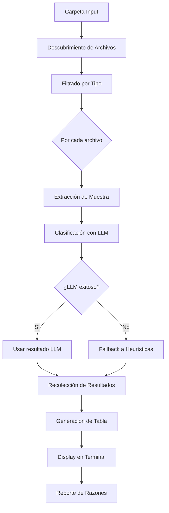

# 📗 Resumen del Clasificador de Preview

Este documento describe, a alto nivel, cómo funciona el clasificador de preview de documentos, sus componentes, configuración y consideraciones prácticas. El objetivo es ofrecer una referencia clara de operación, sin detallar instrucciones de implementación paso a paso.

## 🎯 Propósito
- Validar la categorización de documentos sin generar cache ni persistir datos.
- Probar rápidamente nuevas reglas o modelos de clasificación.
- Exponer razones de decisión de forma legible (UI en terminal).

## 🏗️ Arquitectura (visión general)
- CLI: `scripts/preview_classification.py`
- Wrapper: `src/fraud_scorer/processors/preview/preview_classifier.py`
- Núcleo compartido: `src/fraud_scorer/classification/engine.py`
- Definiciones canónicas: `src/fraud_scorer/processors/document_classifier.py`
- UI (terminal): `src/fraud_scorer/ui/preview_terminal.py`

El preview delega en el “engine” de clasificación para mantener la lógica alineada con el pipeline. El engine expone clasificación por texto (LLM-first) y, opcionalmente, por visión (PDF/imagen) para el modo preview.

## 🔍 Flujo de Clasificación
1) Descubrimiento de archivos soportados en la carpeta seleccionada.
2) Extracción de una muestra de texto (cuando aplica).
3) Clasificación LLM-first (texto) o visión (para PDF/imagen en preview):
   - Si el LLM falla, fallback a heurística del clasificador base.
4) Presentación en UI (tabla, detalles, resumen) sin persistencia.

## 🧠 Núcleo de Clasificación (Engine)
- Archivo: `src/fraud_scorer/classification/engine.py`
- Estrategia: LLM-first (texto) con opción de visión (preview)
- Prompt: construye una guía de tipos a partir de las definiciones de `DocumentClassifier` (palabras clave, must/may/exclude, descripción)
- Validación: garantiza que el tipo retornado esté dentro de los permitidos; si no, clasifica como “otro” y ajusta confianza
- Fallback: ante error del LLM, usa la heurística existente

## 🖼️ Clasificación con Visión (solo preview)
- PDFs: render de 1–2 páginas (220 dpi) en memoria y envío como imágenes al LLM
- Imágenes (jpg/png): envío base64 directo
- Beneficio: clasifica documentos escaneados o sin texto extraíble
- Costo/latencia: mayor que texto; no se usa en pipeline salvo que se habilite explícitamente

## ⚙️ Configuración
- Modelo: `settings.CLASSIFICATION_CONFIG.llm_model` (por defecto `gpt-4o-mini`)
- Temperatura y tokens: `settings.CLASSIFICATION_CONFIG`
- Preview puede usar `.preview_config.yaml` (si existe) para parámetros adicionales de la UI y extracción de muestras.

## 🖥️ UI y Experiencia
- Tabla de resultados (índice, archivo, tipo, confianza, método, OCR)
- Panel de detalles por archivo (razones y muestra de texto opcional)
- Resumen final (distribución por tipo, uso de métodos, OCR requerido)

## 📦 Dependencias
- OpenAI SDK (chat.completions)
- (Opcional) PyMuPDF para visión en PDF (preview)
- `rich`, `typer`, `questionary` para UI/CLI

## ⏱️ Rendimiento y Costos
- Texto (LLM-only): rápido y económico (modelo “mini” recomendado)
- Visión (preview): más costoso; habilitar solo cuando se quieran evaluar documentos escaneados

## 🔒 Persistencia y Seguridad
- Preview no escribe en cache ni DB; la exportación a JSON es opt-in desde CLI
- No modifica archivos de entrada

## 🧭 Relación con el Pipeline Principal
- El preview y el pipeline comparten el mismo engine de clasificación
- El pipeline no usa visión por defecto (se puede habilitar por config global)

## 🧩 Extensión y Mantenimiento
- Para agregar nuevas categorías, modifícalas en `DocumentClassifier` (definiciones canónicas)
- El engine reflejará esos cambios en ambos flujos

## 🔚 Notas
- Este resumen describe “cómo funciona”, no cómo implementarlo desde cero. Los puntos finos de UI/CLI permanecen en los archivos fuente.

## 🏗️ Arquitectura del Sistema

```
scripts/
└── preview_classification.py     # Script principal de preview
    ├── DocumentPreviewClassifier  # Clasificador temporal
    ├── PreviewUI                  # Interfaz de terminal
    └── PreviewReport              # Generador de reportes

src/fraud_scorer/
├── processors/
│   └── preview/
│       ├── __init__.py
│       ├── preview_classifier.py  # Lógica de clasificación preview
│       └── preview_analyzer.py    # Análisis de documentos sin OCR
└── ui/
    └── preview_terminal.py        # UI de terminal con rich
```

## 📦 Dependencias Necesarias

```bash
# Instalar dependencias de UI
pip install rich typer questionary python-magic-bin

# Rich: Para tablas y formato de terminal
# Typer: Para CLI moderna
# Questionary: Para prompts interactivos
# Python-magic: Para detección de tipos MIME
```

## 🔄 Flujo del Sistema



## 💻 Implementación Detallada

### 1️⃣ Script Principal: `scripts/preview_classification.py`

```python
#!/usr/bin/env python3
"""
Sistema de Preview de Clasificación de Documentos
No genera cache ni persiste datos - Solo visualización
"""

import sys
import asyncio
from pathlib import Path
from typing import List, Dict, Any, Optional
from datetime import datetime
import tempfile
import shutil

import typer
from rich.console import Console
from rich.table import Table
from rich.panel import Panel
from rich.progress import Progress, SpinnerColumn, TextColumn
from rich.live import Live
from rich.layout import Layout
from rich.markdown import Markdown
import questionary

# Imports locales
sys.path.append(str(Path(__file__).parent.parent))
from src.fraud_scorer.processors.preview.preview_classifier import DocumentPreviewClassifier
from src.fraud_scorer.ui.preview_terminal import PreviewTerminalUI

# Configuración
console = Console()
app = typer.Typer(
    name="preview-classifier",
    help="Preview de clasificación de documentos sin generar cache",
    add_completion=False
)


class PreviewSession:
    """Sesión temporal de preview"""
    
    def __init__(self, input_folder: Path):
        self.input_folder = input_folder
        self.classifier = DocumentPreviewClassifier()
        self.ui = PreviewTerminalUI(console)
        self.results: List[Dict[str, Any]] = []
        self.start_time = datetime.now()
        
    async def run(self, 
                  use_llm: bool = True,
                  show_samples: bool = False,
                  interactive: bool = True):
        """Ejecuta el preview de clasificación"""
        
        # Mostrar header
        self.ui.show_header(self.input_folder)
        
        # Descubrir archivos
        files = self._discover_files()
        if not files:
            console.print("[red]❌ No se encontraron archivos soportados[/red]")
            return
        
        console.print(f"\n📁 Encontrados [cyan]{len(files)}[/cyan] archivos para analizar")
        
        # Modo interactivo: preguntar configuración
        if interactive:
            config = await self._interactive_config()
            use_llm = config['use_llm']
            show_samples = config['show_samples']
        
        # Procesar archivos con progress bar
        with Progress(
            SpinnerColumn(),
            TextColumn("[progress.description]{task.description}"),
            console=console,
            transient=True
        ) as progress:
            
            task = progress.add_task(
                "[cyan]Analizando documentos...", 
                total=len(files)
            )
            
            for idx, file_path in enumerate(files, 1):
                # Actualizar progress
                progress.update(
                    task, 
                    description=f"[cyan]Analizando {file_path.name}..."
                )
                
                # Clasificar archivo
                result = await self._classify_file(
                    file_path, 
                    idx,
                    use_llm=use_llm
                )
                
                self.results.append(result)
                progress.advance(task)
        
        # Mostrar resultados
        self._show_results_table()
        
        # Mostrar detalles si se solicita
        if show_samples or interactive:
            await self._show_classification_details()
        
        # Resumen final
        self._show_summary()
    
    def _discover_files(self) -> List[Path]:
        """Descubre archivos soportados en la carpeta"""
        supported_extensions = {
            '.pdf', '.jpg', '.jpeg', '.png', 
            '.docx', '.xlsx', '.csv', '.txt'
        }
        
        files = []
        for ext in supported_extensions:
            files.extend(self.input_folder.glob(f"*{ext}"))
            files.extend(self.input_folder.glob(f"*{ext.upper()}"))
        
        return sorted(files)
    
    async def _interactive_config(self) -> Dict[str, Any]:
        """Configuración interactiva del preview"""
        console.print("\n⚙️  [bold]Configuración del Preview[/bold]\n")
        
        config = {}
        
        # Usar LLM?
        config['use_llm'] = questionary.confirm(
            "¿Usar LLM para clasificación cuando sea necesario?",
            default=True
        ).ask()
        
        # Mostrar muestras?
        config['show_samples'] = questionary.confirm(
            "¿Mostrar muestras de texto extraído?",
            default=False
        ).ask()
        
        # Filtrar por tipo?
        filter_types = questionary.confirm(
            "¿Filtrar por tipos específicos de documento?",
            default=False
        ).ask()
        
        if filter_types:
            from src.fraud_scorer.processors.document_classifier import DocumentType
            types = [t.value for t in DocumentType if t != DocumentType.OTRO]
            
            config['filter_types'] = questionary.checkbox(
                "Selecciona los tipos a incluir:",
                choices=types
            ).ask()
        else:
            config['filter_types'] = None
        
        return config
    
    async def _classify_file(self, 
                            file_path: Path, 
                            index: int,
                            use_llm: bool = True) -> Dict[str, Any]:
        """Clasifica un archivo individual"""
        
        # Extraer muestra de texto (sin OCR)
        sample_text = await self._extract_sample(file_path)
        
        # Clasificar
        doc_type, confidence, reasons, method = await self.classifier.classify(
            sample_text=sample_text,
            filename=file_path.name,
            use_llm_fallback=use_llm
        )
        
        # Determinar si necesitaría OCR en producción
        needs_ocr = self._would_need_ocr(file_path, doc_type)
        
        return {
            'index': index,
            'filename': file_path.name,
            'path': str(file_path),
            'size': file_path.stat().st_size,
            'document_type': doc_type,
            'confidence': confidence,
            'reasons': reasons,
            'method': method,  # 'heuristic' o 'llm'
            'needs_ocr': needs_ocr,
            'sample_text': sample_text[:500] if sample_text else None
        }
    
    async def _extract_sample(self, file_path: Path, max_chars: int = 2000) -> str:
        """
        Extrae muestra de texto SIN usar OCR
        Solo extracción nativa cuando es posible
        """
        ext = file_path.suffix.lower()
        
        try:
            if ext == '.txt':
                with open(file_path, 'r', encoding='utf-8', errors='ignore') as f:
                    return f.read(max_chars)
            
            elif ext == '.pdf':
                # Intentar extracción de texto nativo
                import PyPDF2
                with open(file_path, 'rb') as f:
                    reader = PyPDF2.PdfReader(f)
                    text = ""
                    for page in reader.pages[:2]:  # Primeras 2 páginas
                        extracted = page.extract_text()
                        if extracted:
                            text += extracted
                        if len(text) >= max_chars:
                            break
                    return text[:max_chars]
            
            elif ext in ['.docx']:
                # Extraer texto de Word
                from docx import Document
                doc = Document(file_path)
                text = "\n".join([p.text for p in doc.paragraphs[:20]])
                return text[:max_chars]
            
            elif ext in ['.xlsx', '.csv']:
                # Para Excel/CSV, leer primeras filas
                import pandas as pd
                if ext == '.csv':
                    df = pd.read_csv(file_path, nrows=10, error_bad_lines=False)
                else:
                    df = pd.read_excel(file_path, nrows=10)
                return df.to_string()[:max_chars]
            
            elif ext in ['.jpg', '.jpeg', '.png']:
                # Para imágenes, no extraemos texto (necesitaría OCR)
                # Solo retornamos metadata
                return f"[Imagen {ext}: {file_path.name}]"
            
        except Exception as e:
            console.print(f"[yellow]⚠️  No se pudo extraer texto de {file_path.name}: {e}[/yellow]")
        
        return ""
    
    def _would_need_ocr(self, file_path: Path, doc_type: str) -> bool:
        """Determina si el archivo necesitaría OCR en producción"""
        ext = file_path.suffix.lower()
        
        # Imágenes siempre necesitan OCR
        if ext in ['.jpg', '.jpeg', '.png']:
            return True
        
        # PDFs escaneados (heurística: si no se extrajo texto)
        if ext == '.pdf':
            sample = self._extract_sample_sync(file_path)
            if len(sample.strip()) < 100:  # Muy poco texto = probablemente escaneado
                return True
        
        # Según configuración de rutas en settings
        from src.fraud_scorer.settings import ExtractionConfig
        routes = ExtractionConfig.DOCUMENT_EXTRACTION_ROUTES
        
        if doc_type in routes:
            return routes[doc_type] == "ocr_text"
        
        return False
    
    def _extract_sample_sync(self, file_path: Path) -> str:
        """Versión síncrona de extract_sample para chequeos rápidos"""
        try:
            loop = asyncio.get_event_loop()
            return loop.run_until_complete(self._extract_sample(file_path))
        except:
            return ""
    
    def _show_results_table(self):
        """Muestra tabla de resultados de clasificación"""
        
        # Crear tabla
        table = Table(
            title="📋 Resultados de Clasificación",
            show_header=True,
            header_style="bold magenta",
            title_style="bold",
            box=None,
            padding=(0, 1),
        )
        
        # Columnas
        table.add_column("#", style="dim", width=4)
        table.add_column("Archivo", style="cyan", no_wrap=False)
        table.add_column("Tipo Detectado", style="green")
        table.add_column("Confianza", justify="center")
        table.add_column("Método", justify="center")
        table.add_column("OCR", justify="center")
        
        # Filas
        for result in self.results:
            # Color según confianza
            conf = result['confidence']
            if conf >= 0.8:
                conf_color = "green"
            elif conf >= 0.6:
                conf_color = "yellow"
            else:
                conf_color = "red"
            
            # Método usado
            method_icon = "🤖" if result['method'] == 'llm' else "📏"
            
            # Necesita OCR?
            ocr_icon = "✅" if result['needs_ocr'] else "❌"
            
            table.add_row(
                str(result['index']),
                result['filename'][:40],
                result['document_type'],
                f"[{conf_color}]{conf:.1%}[/{conf_color}]",
                method_icon,
                ocr_icon
            )
        
        console.print("\n")
        console.print(table)
    
    async def _show_classification_details(self):
        """Muestra detalles de clasificación para cada archivo"""
        
        console.print("\n📝 [bold]Detalles de Clasificación[/bold]\n")
        
        # Preguntar si quiere ver todos o seleccionar
        choice = questionary.select(
            "¿Qué detalles quieres ver?",
            choices=[
                "Ver todos los archivos",
                "Seleccionar archivos específicos",
                "Ver solo clasificaciones con baja confianza (< 60%)",
                "Ver solo clasificaciones por LLM",
                "Saltar detalles"
            ]
        ).ask()
        
        if choice == "Saltar detalles":
            return
        
        # Filtrar resultados según elección
        if choice == "Ver todos los archivos":
            to_show = self.results
        elif choice == "Seleccionar archivos específicos":
            choices = [f"{r['index']}. {r['filename']}" for r in self.results]
            selected = questionary.checkbox(
                "Selecciona archivos:",
                choices=choices
            ).ask()
            selected_indices = [int(s.split('.')[0]) for s in selected]
            to_show = [r for r in self.results if r['index'] in selected_indices]
        elif choice == "Ver solo clasificaciones con baja confianza (< 60%)":
            to_show = [r for r in self.results if r['confidence'] < 0.6]
        else:  # LLM
            to_show = [r for r in self.results if r['method'] == 'llm']
        
        # Mostrar detalles
        for result in to_show:
            self._show_single_detail(result)
    
    def _show_single_detail(self, result: Dict[str, Any]):
        """Muestra detalle de un archivo individual"""
        
        # Panel con información
        content = f"""
**Archivo:** {result['filename']}
**Tipo detectado:** {result['document_type']}
**Confianza:** {result['confidence']:.1%}
**Método:** {'🤖 LLM (GPT-4o-mini)' if result['method'] == 'llm' else '📏 Heurística'}
**Necesita OCR:** {'✅ Sí' if result['needs_ocr'] else '❌ No'}
**Tamaño:** {result['size'] / 1024:.1f} KB

**📍 Razones de clasificación:**
"""
        
        # Agregar razones
        for reason in result['reasons']:
            content += f"  • {reason}\n"
        
        # Si hay muestra de texto
        if result.get('sample_text') and len(result['sample_text']) > 10:
            content += f"\n**📄 Muestra de texto (primeros 200 chars):**\n```\n{result['sample_text'][:200]}...\n```"
        
        panel = Panel(
            Markdown(content),
            title=f"[bold]#{result['index']} - {result['document_type']}[/bold]",
            border_style="blue",
            padding=(1, 2)
        )
        
        console.print(panel)
        console.print("")
    
    def _show_summary(self):
        """Muestra resumen final"""
        
        # Calcular estadísticas
        total = len(self.results)
        by_type = {}
        by_method = {'heuristic': 0, 'llm': 0}
        avg_confidence = 0
        need_ocr = 0
        
        for r in self.results:
            # Por tipo
            doc_type = r['document_type']
            by_type[doc_type] = by_type.get(doc_type, 0) + 1
            
            # Por método
            by_method[r['method']] += 1
            
            # Confianza
            avg_confidence += r['confidence']
            
            # OCR
            if r['needs_ocr']:
                need_ocr += 1
        
        avg_confidence = avg_confidence / total if total > 0 else 0
        
        # Tiempo transcurrido
        elapsed = (datetime.now() - self.start_time).total_seconds()
        
        # Panel de resumen
        summary = f"""
## 📊 Resumen de Clasificación

**Total de archivos:** {total}
**Tiempo de análisis:** {elapsed:.1f} segundos
**Confianza promedio:** {avg_confidence:.1%}

### 📁 Distribución por tipo:
"""
        
        # Ordenar por cantidad
        for doc_type, count in sorted(by_type.items(), key=lambda x: x[1], reverse=True):
            percentage = (count / total) * 100
            summary += f"  • **{doc_type}:** {count} ({percentage:.1f}%)\n"
        
        summary += f"""

### 🔧 Métodos utilizados:
  • **Heurística:** {by_method['heuristic']} ({(by_method['heuristic']/total)*100:.1f}%)
  • **LLM:** {by_method['llm']} ({(by_method['llm']/total)*100:.1f}%)

### 🔍 Requisitos de OCR:
  • **Necesitan OCR:** {need_ocr} archivos ({(need_ocr/total)*100:.1f}%)
  • **No necesitan OCR:** {total - need_ocr} archivos ({((total-need_ocr)/total)*100:.1f}%)
"""
        
        console.print("\n")
        console.print(Panel(
            Markdown(summary),
            title="[bold green]✅ Análisis Completado[/bold green]",
            border_style="green",
            padding=(1, 2)
        ))


@app.command()
def preview(
    folder: Path = typer.Argument(
        ...,
        help="Carpeta con documentos a clasificar",
        exists=True,
        file_okay=False,
        dir_okay=True,
        resolve_path=True
    ),
    no_llm: bool = typer.Option(
        False,
        "--no-llm",
        help="No usar LLM, solo clasificación heurística"
    ),
    show_samples: bool = typer.Option(
        False,
        "--show-samples",
        "-s",
        help="Mostrar muestras de texto extraído"
    ),
    non_interactive: bool = typer.Option(
        False,
        "--non-interactive",
        "-n",
        help="Modo no interactivo (sin prompts)"
    ),
    export_json: Optional[Path] = typer.Option(
        None,
        "--export-json",
        "-e",
        help="Exportar resultados a archivo JSON"
    )
):
    """
    Preview de clasificación de documentos sin generar cache
    """
    # Header ASCII art
    console.print("""
    ╔══════════════════════════════════════════════════════════╗
    ║     🔍 PREVIEW DE CLASIFICACIÓN DE DOCUMENTOS 🔍        ║
    ║            Sistema de Testing Sin Cache                  ║
    ╚══════════════════════════════════════════════════════════╝
    """, style="bold cyan")
    
    # Crear sesión
    session = PreviewSession(folder)
    
    # Ejecutar análisis
    asyncio.run(session.run(
        use_llm=not no_llm,
        show_samples=show_samples,
        interactive=not non_interactive
    ))
    
    # Exportar si se solicita
    if export_json:
        import json
        with open(export_json, 'w', encoding='utf-8') as f:
            json.dump(session.results, f, indent=2, ensure_ascii=False)
        console.print(f"\n💾 Resultados exportados a: {export_json}")
    
    console.print("\n[bold green]✨ Preview completado. No se generó cache ni datos persistentes.[/bold green]")


if __name__ == "__main__":
    app()
```

### 2️⃣ Clasificador de Preview: `src/fraud_scorer/processors/preview/preview_classifier.py`

```python
"""
Clasificador de documentos para preview (sin persistencia)
"""

import re
import json
import logging
from typing import Dict, Any, List, Tuple, Optional
from pathlib import Path
from dataclasses import dataclass
from datetime import datetime

from openai import AsyncOpenAI
import asyncio

logger = logging.getLogger(__name__)


class DocumentPreviewClassifier:
    """
    Clasificador temporal para preview
    No genera cache ni persiste datos
    """
    
    def __init__(self):
        self.client = AsyncOpenAI()
        self.classification_history = []  # Solo en memoria
        
        # Cargar definiciones de tipos desde document_classifier existente
        from src.fraud_scorer.processors.document_classifier import (
            DocumentClassifier,
            DOCUMENT_DEFINITIONS
        )
        self.base_classifier = DocumentClassifier()
        self.definitions = DOCUMENT_DEFINITIONS
    
    async def classify(self,
                       sample_text: str,
                       filename: str,
                       use_llm: bool = True) -> Tuple[str, float, List[str], str]:
        """
        Clasifica documento usando LLM primero, heurísticas como fallback
        
        Returns:
            - document_type: Tipo de documento detectado
            - confidence: Confianza en la clasificación (0-1)
            - reasons: Lista de razones para la clasificación
            - method: 'llm' o 'heuristic'
        """
        start_time = datetime.now()
        
        doc_type = "otro"
        confidence = 0.0
        reasons = []
        method = 'llm'
        
        # PRIMERO: Intentar clasificación con LLM (si está habilitado)
        if use_llm:
            try:
                doc_type, confidence, reasons = await self._llm_classify_with_descriptions(
                    sample_text[:2000],  # Más texto para mejor contexto
                    filename
                )
                method = 'llm'
                reasons.insert(0, "🤖 Clasificado por LLM con análisis de categorías")
                
            except Exception as e:
                logger.warning(f"Error en clasificación LLM, usando heurísticas: {e}")
                # Si LLM falla, usar heurísticas como fallback
                doc_type, confidence, reasons = self._heuristic_classify(
                    sample_text, filename
                )
                method = 'heuristic'
                reasons.insert(0, "📏 LLM falló, usando heurísticas como fallback")
        else:
            # Si LLM está deshabilitado, usar solo heurísticas
            doc_type, confidence, reasons = self._heuristic_classify(
                sample_text, filename
            )
            method = 'heuristic'
            reasons.insert(0, "📏 Clasificado por heurísticas (LLM deshabilitado)")
        
        # Registrar en historia (solo memoria)
        elapsed = (datetime.now() - start_time).total_seconds()
        self.classification_history.append({
            'filename': filename,
            'document_type': doc_type,
            'confidence': confidence,
            'method': method,
            'elapsed_seconds': elapsed,
            'timestamp': datetime.now().isoformat()
        })
        
        return doc_type, confidence, reasons, method
    
    def _heuristic_classify(self, 
                           text: str, 
                           filename: str) -> Tuple[str, float, List[str]]:
        """Clasificación por reglas heurísticas"""
        
        # Usar el clasificador base pero sin persistencia
        return self.base_classifier._heuristic_classify(text, filename)
    
    async def _llm_classify_with_descriptions(self,
                                             sample_text: str,
                                             filename: str) -> Tuple[str, float, List[str]]:
        """
        Clasificación con LLM usando descripciones detalladas de categorías
        Usa GPT-4o-mini para mantener costos bajos
        """
        
        # Construir prompt con descripciones completas
        prompt = self._build_enhanced_classification_prompt(sample_text, filename)
        
        try:
            response = await self.client.chat.completions.create(
                model="gpt-4o-mini",
                messages=[
                    {
                        "role": "system",
                        "content": """Eres un experto en clasificación de documentos de seguros y siniestros.
Tu tarea es analizar el contenido del documento y compararlo con las descripciones detalladas de cada categoría.
Debes elegir la categoría que mejor se ajuste al documento basándote en:
1. El contenido del documento
2. El nombre del archivo
3. La estructura y formato
4. Las palabras clave presentes
5. El propósito aparente del documento"""
                    },
                    {
                        "role": "user",
                        "content": prompt
                    }
                ],
                temperature=0.1,  # Baja temperatura para consistencia
                max_tokens=400,
                response_format={"type": "json_object"}
            )
            
            # Parsear respuesta
            result = json.loads(response.choices[0].message.content)
            
            # Validar tipo
            if result['document_type'] not in self._get_valid_types():
                result['document_type'] = 'otro'
                result['confidence'] *= 0.5
                result['reasons'].append("Tipo no reconocido, clasificado como 'otro'")
            
            return (
                result['document_type'],
                float(result['confidence']),
                result['reasons']
            )
            
        except Exception as e:
            logger.error(f"Error en clasificación LLM: {e}")
            raise  # Re-lanzar para que el fallback a heurísticas funcione
    
    def _build_enhanced_classification_prompt(self, sample_text: str, filename: str) -> str:
        """Construye prompt mejorado con descripciones detalladas de categorías"""
        
        # Obtener descripciones completas de categorías
        categories_detail = self._build_detailed_categories_guide()
        
        prompt = f"""Analiza el siguiente documento y clasifícalo en la categoría más apropiada.

📋 CATEGORÍAS DISPONIBLES CON DESCRIPCIONES DETALLADAS:

{categories_detail}

📄 DOCUMENTO A ANALIZAR:
━━━━━━━━━━━━━━━━━━━━━━━━━━━━━━━━━━━━━━━━
Nombre del archivo: {filename}
━━━━━━━━━━━━━━━━━━━━━━━━━━━━━━━━━━━━━━━━

Contenido del documento:
{sample_text}
━━━━━━━━━━━━━━━━━━━━━━━━━━━━━━━━━━━━━━━━

🎯 PROCESO DE CLASIFICACIÓN:
1. Lee cuidadosamente el contenido del documento
2. Compara con CADA categoría y su descripción
3. Identifica coincidencias en:
   - Propósito del documento
   - Estructura y formato
   - Palabras clave específicas
   - Contexto de uso
4. Selecciona la categoría que mejor corresponda
5. Si no encaja claramente en ninguna categoría, usa "otro"

📊 RESPUESTA REQUERIDA:
Proporciona tu análisis en formato JSON con esta estructura exacta:
{{
  "document_type": "nombre_exacto_de_categoria",
  "confidence": 0.85,  // Valor entre 0.0 y 1.0
  "reasons": [
    "El documento contiene [elemento específico] que es característico de [categoría]",
    "La estructura muestra [patrón] típico de este tipo de documento",
    "Se identificaron las palabras clave: [lista de palabras encontradas]",
    "El propósito del documento es [propósito] que corresponde a [categoría]"
  ]
}}

IMPORTANTE: El "document_type" debe ser EXACTAMENTE uno de los nombres de categoría listados arriba."""
        return prompt
    
    def _build_detailed_categories_guide(self) -> str:
        """Construye guía detallada de categorías para el LLM"""
        
        # Definiciones completas de cada categoría
        categories = {
            "poliza_de_la_aseguradora": {
                "descripcion": "Documento oficial emitido por la compañía aseguradora que establece los términos del seguro",
                "caracteristicas": [
                    "Contiene número de póliza, vigencia, coberturas",
                    "Incluye datos del asegurado y beneficiarios",
                    "Detalla primas, deducibles y condiciones generales",
                    "Formato oficial con logos y sellos de la aseguradora"
                ],
                "palabras_clave": ["póliza", "vigencia", "cobertura", "prima", "asegurado", "suma asegurada", "condiciones generales"]
            },
            "informe_preliminar_del_ajustador": {
                "descripcion": "Primer reporte del ajustador tras inspección inicial del siniestro",
                "caracteristicas": [
                    "Evaluación inicial de daños y circunstancias",
                    "Fotografías y evidencia preliminar",
                    "Recomendaciones iniciales sobre el caso",
                    "Estimación preliminar de pérdidas"
                ],
                "palabras_clave": ["ajustador", "informe preliminar", "inspección", "evaluación inicial", "recomendaciones"]
            },
            "informe_final_del_ajustador": {
                "descripcion": "Reporte definitivo del ajustador con conclusiones y montos finales",
                "caracteristicas": [
                    "Análisis completo del siniestro",
                    "Determinación final de responsabilidades",
                    "Cálculo definitivo de indemnización",
                    "Conclusiones y recomendaciones finales"
                ],
                "palabras_clave": ["informe final", "conclusiones", "indemnización", "ajuste final", "dictamen"]
            },
            "carta_de_reclamacion_formal_a_la_aseguradora": {
                "descripcion": "Comunicación formal del asegurado reclamando indemnización a la aseguradora",
                "caracteristicas": [
                    "Solicitud formal de pago de siniestro",
                    "Detalle de lo reclamado y montos",
                    "Referencias a la póliza y coberturas",
                    "Documentos anexos de soporte"
                ],
                "palabras_clave": ["reclamación", "solicito", "indemnización", "siniestro", "monto reclamado", "requiero"]
            },
            "guias_y_facturas": {
                "descripcion": "Comprobantes de transporte y documentos comerciales del embarque",
                "caracteristicas": [
                    "Guías de transporte con origen y destino",
                    "Facturas comerciales con valores",
                    "Pueden estar consolidadas o individuales",
                    "Incluyen CFDI cuando aplica"
                ],
                "palabras_clave": ["factura", "guía", "cfdi", "subtotal", "iva", "total", "embarque"]
            },
            "carpeta_de_investigacion": {
                "descripcion": "Expediente oficial de investigación criminal del ministerio público",
                "caracteristicas": [
                    "Número de carpeta o averiguación previa",
                    "Declaraciones y testimonios",
                    "Actuaciones ministeriales",
                    "Formato oficial del MP o fiscalía"
                ],
                "palabras_clave": ["carpeta investigación", "averiguación", "ministerio público", "fiscalía", "denuncia"]
            },
            "tarjeta_de_circulacion_vehiculo": {
                "descripcion": "Documento oficial que acredita el registro vehicular",
                "caracteristicas": [
                    "Datos del vehículo (marca, modelo, placas)",
                    "Datos del propietario",
                    "Vigencia y folios oficiales",
                    "Formato gubernamental"
                ],
                "palabras_clave": ["tarjeta circulación", "vehículo", "placas", "propietario", "modelo"]
            },
            "licencia_del_operador": {
                "descripcion": "Licencia de conducir del operador del vehículo siniestrado",
                "caracteristicas": [
                    "Datos personales del conductor",
                    "Tipo de licencia y vigencia",
                    "Fotografía del conductor",
                    "Formato oficial de tránsito"
                ],
                "palabras_clave": ["licencia", "conductor", "operador", "vigencia", "tipo licencia"]
            },
            "identificacion_oficial": {
                "descripcion": "Documento oficial de identidad (INE/IFE, pasaporte, cédula)",
                "caracteristicas": [
                    "Fotografía y datos personales",
                    "CURP o clave de elector",
                    "No relacionado directamente con el siniestro",
                    "Sirve para acreditar identidad"
                ],
                "palabras_clave": ["ine", "ife", "identificación", "curp", "clave elector", "pasaporte"]
            },
            "notas_de_reparacion": {
                "descripcion": "Comprobantes de servicio o reparación de talleres (no CFDI)",
                "caracteristicas": [
                    "Descripción de servicios realizados",
                    "Lista de refacciones utilizadas",
                    "Costos de mano de obra",
                    "Formato interno del taller"
                ],
                "palabras_clave": ["nota reparación", "servicio", "refacciones", "mano obra", "taller"]
            },
            "dictamen_tecnico": {
                "descripcion": "Diagnóstico técnico especializado sobre las causas del daño",
                "caracteristicas": [
                    "Análisis técnico de causas",
                    "Evaluación pericial",
                    "Conclusiones técnicas",
                    "Diferente a nota de reparación"
                ],
                "palabras_clave": ["dictamen", "diagnóstico", "evaluación técnica", "peritaje", "causa raíz"]
            },
            "comprobante_de_domicilio": {
                "descripcion": "Recibo de servicios para acreditar domicilio (CFE, agua, teléfono)",
                "caracteristicas": [
                    "Nombre del titular y dirección",
                    "Número de servicio",
                    "Periodo facturado",
                    "No relacionado con el siniestro"
                ],
                "palabras_clave": ["cfe", "agua", "luz", "teléfono", "recibo", "servicio", "domicilio"]
            },
            "otro": {
                "descripcion": "Documentos que no encajan en las categorías anteriores",
                "caracteristicas": [
                    "No cumple criterios de otras categorías",
                    "Puede ser relevante pero no clasificable",
                    "Requiere revisión manual"
                ],
                "palabras_clave": []
            }
        }
        
        # Construir texto formateado
        lines = []
        for cat_name, info in categories.items():
            lines.append(f"📁 **{cat_name}**")
            lines.append(f"   📝 Descripción: {info['descripcion']}")
            lines.append(f"   ✅ Características:")
            for char in info['caracteristicas']:
                lines.append(f"      • {char}")
            if info['palabras_clave']:
                lines.append(f"   🔍 Palabras clave: {', '.join(info['palabras_clave'])}")
            lines.append("")  # Línea en blanco entre categorías
        
        return "\n".join(lines)
    
    def _get_valid_types(self) -> List[str]:
        """Obtiene lista de tipos válidos"""
        return list(self.definitions.keys())
    
    def get_classification_stats(self) -> Dict[str, Any]:
        """
        Obtiene estadísticas de la sesión actual
        Solo desde memoria, no persiste
        """
        if not self.classification_history:
            return {
                'total_classified': 0,
                'average_confidence': 0,
                'method_distribution': {},
                'type_distribution': {}
            }
        
        total = len(self.classification_history)
        
        # Calcular promedios y distribuciones
        avg_confidence = sum(h['confidence'] for h in self.classification_history) / total
        
        method_dist = {}
        type_dist = {}
        
        for record in self.classification_history:
            # Método
            method = record['method']
            method_dist[method] = method_dist.get(method, 0) + 1
            
            # Tipo
            doc_type = record['document_type']
            type_dist[doc_type] = type_dist.get(doc_type, 0) + 1
        
        return {
            'total_classified': total,
            'average_confidence': avg_confidence,
            'average_time_seconds': sum(h['elapsed_seconds'] for h in self.classification_history) / total,
            'method_distribution': method_dist,
            'type_distribution': type_dist,
            'low_confidence_count': sum(1 for h in self.classification_history if h['confidence'] < 0.6)
        }
```

### 3️⃣ UI de Terminal: `src/fraud_scorer/ui/preview_terminal.py`

```python
"""
Interfaz de terminal para preview de clasificación
"""

from typing import List, Dict, Any, Optional
from pathlib import Path
from datetime import datetime

from rich.console import Console
from rich.table import Table
from rich.panel import Panel
from rich.layout import Layout
from rich.text import Text
from rich.tree import Tree
from rich.markdown import Markdown
from rich.syntax import Syntax
from rich import box
from rich.columns import Columns
from rich.progress import Progress, BarColumn, TextColumn, TimeRemainingColumn


class PreviewTerminalUI:
    """UI rica para terminal con Rich"""
    
    def __init__(self, console: Console):
        self.console = console
        
    def show_header(self, input_folder: Path):
        """Muestra header del preview"""
        
        header = Panel(
            f"""
[bold cyan]📂 Carpeta analizada:[/bold cyan] {input_folder}
[bold cyan]🕐 Inicio:[/bold cyan] {datetime.now().strftime('%Y-%m-%d %H:%M:%S')}
[bold cyan]🔧 Modo:[/bold cyan] Preview sin cache (no se guardan datos)
            """,
            title="[bold]Preview de Clasificación de Documentos[/bold]",
            subtitle="[dim]Sistema de testing sin persistencia[/dim]",
            border_style="cyan",
            padding=(1, 2)
        )
        
        self.console.print(header)
    
    def show_classification_tree(self, results: List[Dict[str, Any]]):
        """Muestra árbol de clasificación"""
        
        tree = Tree("📁 Documentos Clasificados", style="bold cyan")
        
        # Agrupar por tipo
        by_type = {}
        for result in results:
            doc_type = result['document_type']
            if doc_type not in by_type:
                by_type[doc_type] = []
            by_type[doc_type].append(result)
        
        # Crear nodos del árbol
        for doc_type, docs in sorted(by_type.items()):
            # Nodo de tipo con contador
            type_node = tree.add(
                f"[green]{doc_type}[/green] ({len(docs)} archivos)",
                style="bold"
            )
            
            # Archivos bajo este tipo
            for doc in docs[:5]:  # Mostrar máximo 5 por tipo
                conf_color = self._get_confidence_color(doc['confidence'])
                type_node.add(
                    f"📄 {doc['filename'][:30]} "
                    f"[{conf_color}]({doc['confidence']:.0%})[/{conf_color}]"
                )
            
            if len(docs) > 5:
                type_node.add(f"[dim]... y {len(docs) - 5} más[/dim]")
        
        self.console.print("\n")
        self.console.print(tree)
    
    def show_confidence_distribution(self, results: List[Dict[str, Any]]):
        """Muestra distribución de confianza con barras"""
        
        # Categorizar por niveles de confianza
        high = sum(1 for r in results if r['confidence'] >= 0.8)
        medium = sum(1 for r in results if 0.6 <= r['confidence'] < 0.8)
        low = sum(1 for r in results if r['confidence'] < 0.6)
        total = len(results)
        
        # Crear visualización
        panel_content = f"""
[green]Alta (≥80%):[/green]   {'█' * int((high/total) * 30)} {high} ({high/total:.0%})
[yellow]Media (60-79%):[/yellow] {'█' * int((medium/total) * 30)} {medium} ({medium/total:.0%})
[red]Baja (<60%):[/red]    {'█' * int((low/total) * 30)} {low} ({low/total:.0%})
        """
        
        panel = Panel(
            panel_content,
            title="[bold]Distribución de Confianza[/bold]",
            border_style="blue",
            padding=(1, 2)
        )
        
        self.console.print("\n")
        self.console.print(panel)
    
    def show_method_stats(self, results: List[Dict[str, Any]]):
        """Muestra estadísticas de métodos usados"""
        
        heuristic = sum(1 for r in results if r['method'] == 'heuristic')
        llm = sum(1 for r in results if r['method'] == 'llm')
        total = len(results)
        
        # Crear columnas
        col1 = Panel(
            f"""[bold cyan]📏 Heurística[/bold cyan]
            
Archivos: {heuristic}
Porcentaje: {heuristic/total:.0%}
Promedio confianza: {self._avg_confidence(results, 'heuristic'):.0%}
            """,
            border_style="cyan",
            padding=(1, 2)
        )
        
        col2 = Panel(
            f"""[bold magenta]🤖 LLM (GPT-4o-mini)[/bold magenta]
            
Archivos: {llm}
Porcentaje: {llm/total:.0%}
Promedio confianza: {self._avg_confidence(results, 'llm'):.0%}
            """,
            border_style="magenta",
            padding=(1, 2)
        )
        
        self.console.print("\n")
        self.console.print(Columns([col1, col2]))
    
    def show_ocr_requirements(self, results: List[Dict[str, Any]]):
        """Muestra requisitos de OCR"""
        
        need_ocr = [r for r in results if r['needs_ocr']]
        no_ocr = [r for r in results if not r['needs_ocr']]
        
        table = Table(
            title="🔍 Requisitos de OCR en Producción",
            show_header=True,
            header_style="bold",
            box=box.ROUNDED
        )
        
        table.add_column("Categoría", style="cyan")
        table.add_column("Cantidad", justify="center")
        table.add_column("Porcentaje", justify="center")
        table.add_column("Ejemplos", no_wrap=False)
        
        # Fila OCR necesario
        if need_ocr:
            examples = ", ".join([r['filename'][:20] for r in need_ocr[:3]])
            if len(need_ocr) > 3:
                examples += f" (+{len(need_ocr)-3} más)"
            
            table.add_row(
                "✅ Necesitan OCR",
                str(len(need_ocr)),
                f"{len(need_ocr)/len(results):.0%}",
                examples
            )
        
        # Fila sin OCR
        if no_ocr:
            examples = ", ".join([r['filename'][:20] for r in no_ocr[:3]])
            if len(no_ocr) > 3:
                examples += f" (+{len(no_ocr)-3} más)"
            
            table.add_row(
                "❌ No necesitan OCR",
                str(len(no_ocr)),
                f"{len(no_ocr)/len(results):.0%}",
                examples
            )
        
        self.console.print("\n")
        self.console.print(table)
    
    def _get_confidence_color(self, confidence: float) -> str:
        """Retorna color según nivel de confianza"""
        if confidence >= 0.8:
            return "green"
        elif confidence >= 0.6:
            return "yellow"
        else:
            return "red"
    
    def _avg_confidence(self, results: List[Dict[str, Any]], method: str) -> float:
        """Calcula confianza promedio para un método"""
        filtered = [r['confidence'] for r in results if r['method'] == method]
        return sum(filtered) / len(filtered) if filtered else 0
```

## 📝 Archivo de Configuración: `.preview_config.yaml`

```yaml
# Configuración para preview de clasificación
preview:
  # Modelo LLM a usar
  llm_model: "gpt-4o-mini"
  
  # Umbral de confianza para usar LLM
  confidence_threshold: 0.6
  
  # Máximo de caracteres a extraer por archivo
  max_sample_chars: 2000
  
  # Extensiones soportadas
  supported_extensions:
    - .pdf
    - .jpg
    - .jpeg
    - .png
    - .docx
    - .xlsx
    - .csv
    - .txt
  
  # Configuración de UI
  ui:
    show_samples_by_default: false
    max_files_per_type_in_tree: 5
    enable_colors: true
    
  # Límites
  limits:
    max_files: 1000
    max_file_size_mb: 50
```

## 🚀 Guía de Uso

### Instalación

```bash
# 1. Instalar dependencias
pip install rich typer questionary python-magic-bin PyPDF2 python-docx pandas openpyxl

# 2. Dar permisos de ejecución
chmod +x scripts/preview_classification.py

# 3. Crear alias (opcional)
alias doc-preview="python scripts/preview_classification.py"
```

### Comandos de Ejemplo

```bash
# Preview básico interactivo
python scripts/preview_classification.py /path/to/documents

# Sin usar LLM (solo heurística)
python scripts/preview_classification.py /path/to/documents --no-llm

# Mostrar muestras de texto
python scripts/preview_classification.py /path/to/documents --show-samples

# Modo no interactivo
python scripts/preview_classification.py /path/to/documents --non-interactive

# Exportar resultados a JSON
python scripts/preview_classification.py /path/to/documents --export-json results.json

# Combinación de opciones
python scripts/preview_classification.py /path/to/documents --no-llm --show-samples -n
```

## 🎨 Ejemplos de Salida

### Vista de Tabla Principal
```
📋 Resultados de Clasificación
┌────┬─────────────────────────┬────────────────────────┬──────────┬────────┬─────┐
│ #  │ Archivo                 │ Tipo Detectado         │ Confianza│ Método │ OCR │
├────┼─────────────────────────┼────────────────────────┼──────────┼────────┼─────┤
│ 1  │ poliza_2025.pdf        │ poliza_de_la_aseguradora│   95%    │   📏   │  ✅ │
│ 2  │ factura_123.jpg        │ guias_y_facturas       │   82%    │   📏   │  ✅ │
│ 3  │ documento_x.pdf        │ otro                   │   45%    │   🤖   │  ❌ │
└────┴─────────────────────────┴────────────────────────┴──────────┴────────┴─────┘
```

### Vista de Árbol de Clasificación
```
📁 Documentos Clasificados
├── poliza_de_la_aseguradora (2 archivos)
│   ├── 📄 poliza_2025.pdf (95%)
│   └── 📄 poliza_anterior.pdf (88%)
├── guias_y_facturas (5 archivos)
│   ├── 📄 factura_123.jpg (82%)
│   ├── 📄 factura_456.pdf (79%)
│   └── ... y 3 más
└── otro (1 archivo)
    └── 📄 documento_x.pdf (45%)
```

### Panel de Detalles
```
╭─────────────────────────────────────────────────────╮
│ #1 - poliza_de_la_aseguradora                      │
├─────────────────────────────────────────────────────┤
│ Archivo: poliza_2025.pdf                           │
│ Tipo detectado: poliza_de_la_aseguradora          │
│ Confianza: 95.0%                                   │
│ Método: 📏 Heurística                              │
│ Necesita OCR: ✅ Sí                                │
│ Tamaño: 245.3 KB                                   │
│                                                     │
│ 📍 Razones de clasificación:                       │
│   • texto: 'póliza'                               │
│   • texto: 'vigencia'                             │
│   • texto: 'suma asegurada'                       │
│   • nombre: 'poliza'                              │
╰─────────────────────────────────────────────────────╯
```

## ⚡ Optimizaciones y Consideraciones

### Rendimiento
- **Sin OCR**: El sistema NO usa OCR, solo extracción nativa de texto
- **Caché temporal**: Usa diccionarios en memoria, no persiste nada
- **Procesamiento paralelo**: Posibilidad de procesar múltiples archivos concurrentemente
- **Límites configurables**: Máximo de archivos y tamaño para evitar sobrecarga

### Seguridad
- **No persiste datos**: Toda la información se mantiene en memoria
- **No genera archivos**: No crea cache, logs ni archivos temporales
- **Aislamiento**: Cada sesión es completamente independiente
- **Sin modificaciones**: Solo lectura de archivos, nunca escritura

### Costos
- **Modelo económico**: GPT-4o-mini para clasificación (95% más barato)
- **LLM primero**: Usa LLM con descripciones detalladas para máxima precisión
- **Heurísticas como fallback**: Solo si el LLM falla o está deshabilitado
- **Límite de tokens**: Máximo 2000 caracteres por clasificación para mejor contexto
- **Sin OCR**: Ahorro completo en procesamiento OCR

## 🧪 Testing del Sistema

```python
# test_preview_system.py
import pytest
from pathlib import Path
from scripts.preview_classification import PreviewSession

@pytest.mark.asyncio
async def test_preview_no_persistence():
    """Verifica que no se genera persistencia"""
    # Crear sesión
    session = PreviewSession(Path("./test_docs"))
    
    # Ejecutar
    await session.run(interactive=False)
    
    # Verificar que no hay archivos creados
    assert not Path("./data/cache").exists()
    assert not Path("./data/uploads").exists()
    
    # Verificar resultados en memoria
    assert len(session.results) > 0
    assert all('document_type' in r for r in session.results)
```

## 📊 Métricas y Monitoreo

El sistema trackea internamente (sin persistir):
- Total de archivos procesados
- Distribución por tipo de documento
- Confianza promedio por método
- Tiempo de procesamiento
- Archivos que necesitarían OCR
- Fallos de clasificación

## 🔄 Integración con Sistema Principal

Este sistema de preview es **completamente independiente** del pipeline principal:
- No usa `run_report.py`
- No genera cache OCR
- No persiste en base de datos
- No afecta archivos originales
- No interfiere con producción

## 🎯 Casos de Uso

1. **Validación pre-producción**: Verificar clasificación antes de procesar
2. **Testing de nuevas categorías**: Probar nuevos tipos de documento
3. **Debugging**: Entender por qué un documento se clasifica incorrectamente
4. **Estimación de costos**: Ver cuántos archivos necesitarían LLM/OCR
5. **Demo a clientes**: Mostrar capacidades sin procesar datos reales

---

## ✅ Checklist de Implementación

- [ ] Crear estructura de carpetas
- [ ] Instalar dependencias (`rich`, `typer`, `questionary`)
- [ ] Implementar `preview_classification.py`
- [ ] Crear `preview_classifier.py`
- [ ] Implementar `preview_terminal.py`
- [ ] Configurar `.preview_config.yaml`
- [ ] Crear tests unitarios
- [ ] Documentar comandos de uso
- [ ] Validar que no genera persistencia
- [ ] Verificar costos de API
