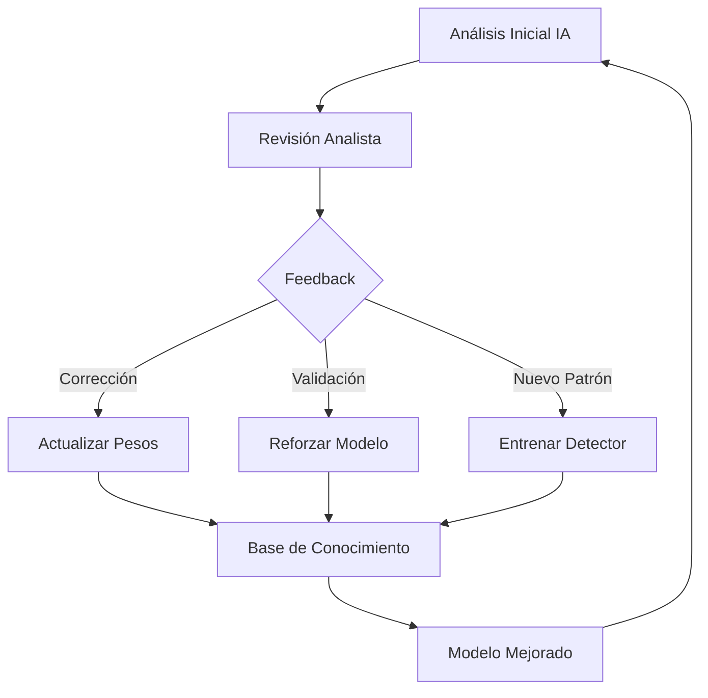
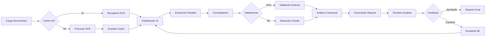

# 🎯 VISIÓN DEL SISTEMA DE ANÁLISIS INTELIGENTE DE SINIESTROS
## Documento de Arquitectura y Diseño Estratégico v2.0

---

## 📋 RESUMEN EJECUTIVO

Este documento define la visión integral para un **Sistema de Análisis de Siniestros Inteligente** de siguiente generación, diseñado para revolucionar la manera en que las compañías de seguros evalúan y procesan reclamaciones mediante la automatización inteligente y el análisis predictivo de fraude.

El sistema combina tecnologías de punta incluyendo:
- **Procesamiento OCR avanzado** con Azure Document Intelligence
- **Inteligencia Artificial generativa** (GPT-4) para análisis semántico
- **Machine Learning adaptativo** para mejora continua
- **Sistema de validación multicapa** con APIs gubernamentales
- **Motor de análisis forense** para detección de alteraciones documentales

### 🎯 Objetivo Principal
Generar reportes de análisis de siniestros de calidad profesional de manera **automatizada**, reduciendo el tiempo de análisis de días a minutos mientras se incrementa la precisión en la detección de tentativas de fraude.

---

## 🏗️ ARQUITECTURA DEL SISTEMA

### 📐 Estructura Modular Actual y Propuesta

#### **Componentes Core Implementados**

1. **Motor OCR (Azure Document Intelligence)**
   - Ubicación: `src/fraud_scorer/processors/ocr/azure_ocr.py`
   - Estado: ✅ Funcional
   - Capacidad: Extracción de texto, tablas, entidades y metadatos
   - Mejoras necesarias: Implementar procesamiento paralelo y fallback a Tesseract

2. **Sistema de Caché Inteligente**
   - Ubicación: `src/fraud_scorer/storage/ocr_cache.py`
   - Estado: ⚠️ Parcialmente funcional
   - Arquitectura: Dual (hash-based shards + vista humana organizada)
   - Mejoras críticas:
     - Sincronización DB-FS mejorada
     - Garbage collection automático
     - Métricas de eficiencia en tiempo real

3. **Motor de Extracción IA**
   - Ubicación: `src/fraud_scorer/processors/ai/ai_field_extractor.py`
   - Estado: ✅ Funcional
   - Modelo: GPT-4o-mini (económico) / GPT-4o (precisión)
   - Mejoras propuestas:
     - Implementar prompt engineering dinámico
     - Cache de embeddings para documentos similares
     - Fine-tuning con casos históricos

4. **Sistema de Consolidación**
   - Ubicación: `src/fraud_scorer/processors/ai/ai_consolidator.py`
   - Estado: ✅ Funcional básico
   - Lógica: Ponderación por confiabilidad de fuente
   - Mejoras necesarias:
     - Sistema de votación con pesos adaptativos
     - Detección de conflictos críticos
     - Trazabilidad de decisiones

5. **Base de Datos Relacional**
   - Ubicación: `src/fraud_scorer/storage/db.py`
   - Estado: ⚠️ Requiere optimización
   - Esquema: 9 tablas principales con índices
   - Problemas identificados:
     - Duplicación de registros
     - Falta de constraints únicos compuestos
     - Necesidad de migración a PostgreSQL para producción

#### **Componentes Propuestos para Implementar**

1. **Motor de Machine Learning Adaptativo**
   - Framework sugerido: **LightGBM** + **Active Learning**
   - Funcionalidad:
     - Aprendizaje incremental de patrones de fraude
     - Retroalimentación supervisada de analistas
     - Auto-ajuste de umbrales de riesgo
   - Implementación:
     ```python
     class AdaptiveFraudDetector:
         def __init__(self):
             self.model = LGBMClassifier()
             self.feature_extractor = DocumentFeatureExtractor()
             self.feedback_buffer = FeedbackBuffer(max_size=1000)

         def learn_from_feedback(self, document_features, analyst_decision, confidence):
             # Active learning loop
             pass
     ```

2. **Sistema de Validación Externa**
   - APIs a integrar:
     - **SAT** - Validación de CFDI y RFC
     - **REPUVE** - Verificación vehicular
     - **INE/IFE** - Validación de identidades
     - **CURP/RENAPO** - Verificación de personas
   - Arquitectura: Sistema de plugins con fallback y retry logic

3. **Motor de Análisis Forense Digital**
   - Capacidades:
     - Detección de alteraciones en metadatos PDF
     - Análisis de consistencia tipográfica
     - Detección de capas y elementos superpuestos
     - Verificación de firmas digitales
   - Herramientas: PyPDF2 + Computer Vision

---

## 📊 ESTRUCTURA DEL REPORTE DE SINIESTRO - ANÁLISIS BASADO EN CASOS REALES

### Estructura Identificada en los Reportes Reales

Tras el análisis exhaustivo de los reportes reales de HDI Seguros, he identificado la estructura precisa y los patrones de contenido que deben replicarse:

#### **1. INFORMACIÓN GENERAL (CARÁTULA)**
**Estado Actual:** ✅ Parcialmente implementado
**Campos exactos identificados:**
- **Número de siniestro**: Formato YYYYXXXXXXX (ej: 20250000004129)
- **Nombre del asegurado**: Razón social completa
- **Número de póliza**: Formato XX-XXXX o XXX-XXXX con inciso opcional
- **Vigencia**: DD/MM/YYYY al DD/MM/YYYY
- **Domicilio de la póliza**: Dirección completa con C.P.
- **Bien reclamado**: Descripción precisa de la mercancía
- **Monto de reclamación**: En MXN con formato $X,XXX,XXX.XX
- **Tipo de siniestro**: Robo/Robo parcial/Robo de bulto/Daño/etc.
- **Fecha de ocurrencia del siniestro**: DD de MES del YYYY
- **Fecha de reclamación**: DD de MES del YYYY
- **Lugar de los hechos**: Ubicación específica del incidente
- **Ajuste**: Despacho de ajustadores asignado
- **Conclusiones**: "CON TENTATIVA" o "SIN TENTATIVA"

**Mejoras Críticas Necesarias:**
- Extracción automática del formato de fecha consistente
- Validación del formato de número de siniestro
- Detección automática del despacho de ajustadores

#### **2. ANÁLISIS DEL TURNO PARA SU INVESTIGACIÓN**
**Estado:** ✅ Texto estático identificado
**Texto estándar usado:**
"Como inicio del presente análisis documental y validación de documentación que se realizó de forma técnica basada en principios de criminalística, jurídicos y criminológicos para postular una sugerencia con sustentos indubitables a la compañía."

#### **3. PLANTEAMIENTO DEL PROBLEMA**
**Estado:** ⚠️ Semi-dinámico
**Patrones identificados:**
- Inicia con contexto del tipo de reclamación
- Menciona el asegurado y fecha del siniestro
- Describe brevemente el tipo de incidente
- Establece el objetivo de verificación

**Template dinámico propuesto:**
```python
def generar_planteamiento(datos_siniestro):
    templates = {
        "robo": "Se ha recibido una reclamación por el robo de {mercancia}. Según la información inicial, {descripcion_evento}. Para procesar esta reclamación, es imperativo realizar una minuciosa verificación de toda la información y documentación proporcionada por el asegurado.",
        "daño": "El presente siniestro fue turnado a esta área para la validación y verificación de los datos que conforman el expediente, ya que {razon_especial}.",
        "robo_parcial": "Se recibe la reclamación del asegurado, {nombre_asegurado}, por un siniestro ocurrido el {fecha}. El evento reportado es un {tipo_siniestro} de mercancía en tránsito..."
    }
```

#### **4. MÉTODOS EMPLEADOS PARA LA INVESTIGACIÓN**
**Estado:** ✅ Lista dinámica según el caso
**Métodos comunes identificados:**
- Análisis y validación de la documentación proporcionada por el asegurado
- Consultas gubernamentales (SAT, REPUVE, SCT)
- Validación con empresa transportista
- Consultas web de los involucrados
- Análisis técnico del reporte de monitoreo GPS
- Verificación de carpetas de investigación
- Validación de ministerios públicos

#### **5. ESTUDIO DEL ASEGURADO**
**Estado:** 🔴 Básico, necesita mejoras
**Estructura real identificada:**
1. Nombre/Razón social
2. RFC (cuando aplica)
3. Búsqueda en sitios web sobre actividades económicas
4. Verificación de antecedentes en fuentes abiertas
5. Relación con otras empresas del grupo (si existe)
6. Conclusión sobre hallazgos relevantes

**Implementación mejorada necesaria:**
```python
class EstudioAsegurado:
    def generar_estudio(self, asegurado_data):
        estudio = f"""
{asegurado_data['razon_social']}
Se realizó consulta en sitios web con el nombre de la razón social del asegurado,
donde apreciamos información correspondiente en sitios web sobre las actividades
económicas de {asegurado_data['giro_comercial']}.

{self.buscar_antecedentes(asegurado_data['rfc'])}
{self.verificar_grupo_empresarial(asegurado_data['razon_social'])}
"""
```

#### **6. ANÁLISIS DE LA DOCUMENTACIÓN [SECCIÓN MÁS EXTENSA]**
**Estado:** ⚠️ Parcialmente implementado
**Estructura real por documento:**

Cada documento analizado sigue este patrón:
```
> [NOMBRE DEL DOCUMENTO EN MAYÚSCULAS]
[Descripción del documento y datos clave extraídos]
[Análisis de consistencia y validez]
[Si aplica: resultado de validación externa]
[Si hay anomalías: descripción detallada]
```

**Documentos típicos analizados (orden común):**
1. **CARTA RECLAMACIÓN DIRIGIDA A HDI SEGUROS**
2. **CARTA RECLAMACIÓN DIRIGIDA AL TRANSPORTISTA**
3. **CARTA RESPUESTA TRANSPORTISTA**
4. **CARPETA DE INVESTIGACIÓN (DENUNCIA)**
5. **VALIDACIÓN DE MINISTERIO PÚBLICO**
6. **ESTUDIO TÉCNICO DE RUTA**
7. **LICENCIA DE CONDUCIR DEL OPERADOR + VALIDACIÓN**
8. **TARJETA DE CIRCULACIÓN**
9. **CONSULTA EN REPUVE CIUDADANO**
10. **CONSULTA EN SCT**
11. **CARTAS PORTE + VALIDACIÓN SAT**
12. **PEDIMENTO + VALIDACIÓN**
13. **FACTURAS/INVOICES**
14. **SEGUIMIENTO GPS**
15. **CONSULTAS WEB DE INVOLUCRADOS**

**Sistema de análisis correlacionado necesario:**
```python
class AnalizadorDocumental:
    def analizar_con_contexto(self, documento, contexto_global):
        # Análisis individual
        analisis = self.analisis_base(documento)

        # Correlación con otros documentos
        contradicciones = self.detectar_contradicciones(analisis, contexto_global)

        # Validaciones externas
        if documento.requiere_validacion:
            analisis['validacion'] = self.validar_externo(documento)

        # Actualizar contexto global
        contexto_global.actualizar(analisis)

        return self.formatear_para_reporte(analisis, contradicciones)
```

#### **7. CONSIDERACIONES/OBSERVACIONES**
**Estado:** 🔴 No implementado
**Estructura real identificada:**
- Lista numerada de hallazgos principales
- Cada punto es una síntesis de evidencia clave
- Incluye tanto elementos a favor como en contra
- Señala específicamente inconsistencias encontradas
- Menciona oportunidades de subrogación cuando aplican

**Generador de consideraciones propuesto:**
```python
class GeneradorConsideraciones:
    def generar(self, analisis_documentos, nivel_riesgo):
        consideraciones = []

        # Extraer hallazgos críticos
        for doc in analisis_documentos:
            if doc.tiene_anomalias:
                consideraciones.append(self.formatear_anomalia(doc))

        # Agregar validaciones exitosas relevantes
        validaciones_clave = self.extraer_validaciones_clave(analisis_documentos)

        # Ordenar por importancia/severidad
        return self.ordenar_por_importancia(consideraciones)
```

#### **8. CONCLUSIÓN DE VERIFICACIÓN**
**Estado:** 🔴 No implementado
**Estructura real identificada:**

**Para casos CON TENTATIVA:**
- Declaración contundente de tentativa de fraude
- Fundamentación legal (cita de artículos de la Ley sobre el Contrato de Seguro)
- Enumeración de evidencias principales
- Recomendación de RECHAZO TOTAL

**Para casos SIN TENTATIVA:**
- Confirmación de legitimidad del siniestro
- Resumen de evidencias que soportan la validez
- Observaciones para el área de ajuste
- Recomendaciones de indemnización con ajustes si aplican

**Motor de decisión necesario:**
```python
class MotorConclusion:
    def generar_conclusion(self, evidencias, score_fraude):
        if score_fraude > 0.7:
            return self.conclusion_con_tentativa(evidencias)
        else:
            return self.conclusion_sin_tentativa(evidencias)

    def conclusion_con_tentativa(self, evidencias):
        return f"""SE DETERMINA LA EXISTENCIA DE UNA TENTATIVA DE FRAUDE.

{self.enumerar_evidencias_criticas(evidencias)}

Conforme a los artículos 8° y 70 de la Ley sobre el Contrato de Seguro:
Artículo 70.- "Las obligaciones de la empresa quedarán extinguidas si demuestra que el asegurado,
el beneficiario o los representantes de ambos, con el fin de hacerla incurrir en error,
disimulan o declaran inexactamente hechos..."

Se recomienda el RECHAZO TOTAL Y DEFINITIVO de la reclamación.
"""
```

#### **9. FIRMA Y CONFIDENCIALIDAD**
**Texto estándar al final:**
"INFORME CONFIDENCIAL PARA USO INFORMATIVO EXCLUSIVO DE HDI SEGUROS"

---

## 🚨 PATRONES DE FRAUDE IDENTIFICADOS EN CASOS REALES

### Indicadores de Alta Criticidad

Basándome en el análisis de los casos reales, he identificado los siguientes patrones críticos que el sistema debe detectar automáticamente:

#### **1. Inconsistencias Documentales**
- **Documentos apócrifos**: Cartas falsificadas de transportistas (caso MODA YKT)
- **Discrepancias en placas vehiculares**: Diferentes placas en carta porte vs tarjeta de circulación
- **Conflictos de NIV/VIN**: Marca en REPUVE diferente a tarjeta de circulación
- **Fechas incongruentes**: Timbrado de carta porte posterior al siniestro

#### **2. Señales Temporales**
- **Reporte temprano**: Siniestros reportados dentro de los primeros 30 días de vigencia
- **Unidades con reporte previo**: Vehículos con estatus de robo anterior al siniestro actual
- **Demoras inexplicables**: Meses entre el siniestro y la reclamación sin justificación

#### **3. Anomalías Operativas**
- **Licencias vencidas o inadecuadas**: Operadores sin facultades legales al momento del siniestro
- **Rutas ilógicas**: Desvíos no justificados de la ruta comercial esperada
- **GPS inconsistente**: Discrepancias entre ubicación GPS y lugar declarado

#### **4. Validaciones Fallidas**
- **CFDI cancelado o inexistente**: Cartas porte sin validez en SAT
- **Ministerio Público no validable**: Cédulas profesionales inexistentes
- **Valores incongruentes**: Monto reclamado vs valor en carta porte

### Sistema de Scoring de Fraude Propuesto

```python
class FraudScoringEngine:
    def __init__(self):
        self.weights = {
            'documento_apocrifo': 1.0,  # Determinante
            'placas_inconsistentes': 0.8,
            'fechas_incongruentes': 0.7,
            'licencia_vencida': 0.4,
            'reporte_temprano': 0.3,
            'valor_incongruente': 0.5,
            'gps_inconsistente': 0.6,
            'cfdi_invalido': 0.9
        }

    def calculate_fraud_score(self, indicators):
        score = 0
        for indicator, present in indicators.items():
            if present:
                score += self.weights.get(indicator, 0)

        # Normalizar a escala 0-1
        return min(score / 3.0, 1.0)

    def get_risk_level(self, score):
        if score >= 0.7:
            return "CRÍTICO - TENTATIVA DE FRAUDE PROBABLE"
        elif score >= 0.5:
            return "ALTO - REQUIERE INVESTIGACIÓN PROFUNDA"
        elif score >= 0.3:
            return "MEDIO - VERIFICACIÓN ADICIONAL NECESARIA"
        else:
            return "BAJO - SIN INDICIOS SIGNIFICATIVOS"
```

---

## 🔍 SISTEMA DE VALIDACIONES CRÍTICAS

### Validaciones Automáticas Implementadas y Por Implementar

#### **Validaciones Gubernamentales (APIs)**

1. **SAT - Servicio de Administración Tributaria**
   - Validación de CFDI (Cartas Porte)
   - Verificación de RFC
   - Estado de facturas (Vigente/Cancelado)
   - Complemento Carta Porte

2. **REPUVE - Registro Público Vehicular**
   - Estado de robo del vehículo
   - Verificación de NIV/VIN
   - Historial de reportes
   - Datos del propietario registrado

3. **SCT - Secretaría de Comunicaciones y Transportes**
   - Validación de placas federales
   - Permisos de transporte
   - Licencias federales de conductor

4. **CURP/RENAPO**
   - Validación de identidad de personas
   - Verificación de CURP
   - Datos biográficos

5. **Fiscalías Estatales**
   - Validación de carpetas de investigación
   - Verificación de ministerios públicos
   - Cédulas profesionales

### Arquitectura de Validación Propuesta

```python
class ValidationOrchestrator:
    def __init__(self):
        self.validators = {
            'sat': SATValidator(),
            'repuve': REPUVEValidator(),
            'sct': SCTValidator(),
            'curp': CURPValidator(),
            'fiscalia': FiscaliaValidator()
        }
        self.cache = ValidationCache()

    async def validate_document(self, doc_type, doc_data):
        # Verificar cache primero
        cached = self.cache.get(doc_data['hash'])
        if cached:
            return cached

        # Determinar validadores necesarios
        validators_needed = self.get_validators_for_doc(doc_type)

        # Ejecutar validaciones en paralelo
        results = await asyncio.gather(*[
            self.validators[v].validate(doc_data)
            for v in validators_needed
        ])

        # Consolidar resultados
        validation_result = self.consolidate_results(results)

        # Guardar en cache
        self.cache.save(doc_data['hash'], validation_result)

        return validation_result

    def get_validators_for_doc(self, doc_type):
        mapping = {
            'carta_porte': ['sat'],
            'tarjeta_circulacion': ['repuve', 'sct'],
            'licencia': ['sct'],
            'factura': ['sat'],
            'pedimento': ['sat'],
            'carpeta_investigacion': ['fiscalia'],
            'identidad': ['curp']
        }
        return mapping.get(doc_type, [])
```

---

## 🤖 SISTEMA DE MACHINE LEARNING ADAPTATIVO

### Arquitectura Propuesta de Retroalimentación



### Implementación Técnica Sugerida

**1. Sistema de Feedback Estructurado:**
```python
class FeedbackSystem:
    def __init__(self):
        self.feedback_db = FeedbackDatabase()
        self.model_trainer = IncrementalTrainer()

    def capture_feedback(self, document_id, original_analysis, corrections):
        feedback = {
            "timestamp": datetime.now(),
            "document_type": document.type,
            "original": original_analysis,
            "corrections": corrections,
            "analyst_id": current_user.id,
            "confidence": analyst_confidence_score
        }

        # Almacenar para batch training
        self.feedback_db.store(feedback)

        # Actualización incremental si hay suficientes muestras
        if self.feedback_db.pending_count() > 50:
            self.trigger_retraining()
```

**2. Mejora de Guías YAML Dinámicas:**
```python
class GuideEvolution:
    def evolve_guide(self, guide_yaml, feedback_batch):
        # Analizar patrones en correcciones
        patterns = self.extract_patterns(feedback_batch)

        # Actualizar reglas de detección
        for pattern in patterns:
            if pattern.confidence > 0.8:
                guide_yaml['fraud_indicators'].append(pattern)

        # Ajustar pesos de validación
        guide_yaml['validation_weights'] = self.recalculate_weights(feedback_batch)

        return guide_yaml
```

---

## 📝 SISTEMA DE GUÍAS YAML MEJORADO

### Estructura Optimizada de Guías para Análisis Documental

Basándome en el análisis de las guías existentes y los patrones encontrados en los reportes reales, propongo la siguiente estructura mejorada:

```yaml
metadata:
  type: [tipo_documento]
  version: "2.0"
  author: "Sistema Experto HDI"
  last_updated: "2025-01-20"
  description: "Guía especializada mejorada con patrones de casos reales"
  criticality_level: "alta|media|baja"

definition:
  nature: "Descripción de la naturaleza legal/operativa del documento"
  legal_importance: "Alta|Media|Baja - Justificación"
  purpose_in_claim: "Por qué este documento es crítico para el siniestro"

  critical_elements:
    - field_name:
        description: "Qué es y por qué es importante"
        format: "Formato esperado"
        validation_rule: "Regla de validación"
        cross_reference: ["documentos_relacionados"]
        fraud_weight: 0.0-1.0

methodology:
  analysis_approach: |
    Enfoque paso a paso actualizado basado en casos reales

  fraud_indicators:
    critical:  # Determinantes de fraude
      - pattern: "nombre_patron"
        detection: "Cómo detectarlo"
        examples_from_cases: ["caso_referencia"]
        automatic_score: 0.9-1.0

    high_risk:  # Alta probabilidad
      - pattern: "nombre_patron"
        detection: "Método de detección"
        automatic_score: 0.6-0.8

    medium_risk:  # Requiere correlación
      - pattern: "nombre_patron"
        detection: "Señales a buscar"
        automatic_score: 0.3-0.5

  validation_requirements:
    external_apis:
      - api: "SAT|REPUVE|SCT|FISCALIA"
        fields_to_validate: []
        expected_response: {}

    cross_document_checks:
      - check_name: "coherencia_placas"
        documents_involved: ["carta_porte", "tarjeta_circulacion"]
        validation_logic: "Las placas deben coincidir exactamente"

response_template:
  output_format:
    # Estructura exacta como en los reportes reales
    section_header: "> [NOMBRE DEL DOCUMENTO]"

    content_structure:
      - description_paragraph: |
          Plantilla para describir el documento y datos extraídos
      - validation_paragraph: |
          Plantilla para resultados de validación
      - anomalies_paragraph: |
          Plantilla para describir anomalías si existen

    risk_assessment:
      risk_level: "bajo|medio|alto|critico"
      fraud_indicators_found: []
      validation_status: "exitosa|fallida|pendiente"

    correlations:
      related_documents: []
      contradictions_found: []
      supporting_evidence: []

machine_learning:
  trainable_elements:
    - extraction_patterns
    - fraud_indicators
    - validation_rules

  feedback_incorporation:
    - analyst_corrections
    - false_positive_adjustments
    - new_pattern_detection
```

### Guías Específicas Necesarias Basadas en Casos Reales

#### **1. Carta de Reclamación a HDI**
```yaml
critical_validations:
  - Fecha de reclamación vs fecha de siniestro (demora sospechosa)
  - Monto reclamado vs documentos soporte
  - Firma y datos del reclamante
  - Coherencia en la narrativa de hechos
```

#### **2. Carpeta de Investigación**
```yaml
critical_validations:
  - Validación de número de carpeta con fiscalía
  - Verificación de cédula profesional del MP
  - Consistencia entre declaraciones múltiples
  - Fechas y horas coherentes con otros documentos
```

#### **3. Carta Porte / CFDI**
```yaml
critical_validations:
  - Timbrado SAT válido y vigente
  - Fecha de timbrado anterior al siniestro
  - Placas consistentes con tarjetas de circulación
  - Valor declarado vs valor reclamado
  - Complemento Carta Porte presente
```

#### **4. Seguimiento GPS**
```yaml
critical_validations:
  - Coherencia de ruta con origen/destino declarados
  - Tiempo de detención en lugar del siniestro
  - Velocidad y patrones de manejo
  - Última transmisión vs hora declarada del robo
```

---

## 💾 OPTIMIZACIÓN DE CACHE Y BASE DE DATOS

### Problemas Identificados y Soluciones

#### **Problema 1: Duplicación de Registros**
**Causa:** Falta de constraints únicos compuestos
**Solución:**
```sql
ALTER TABLE documents ADD CONSTRAINT uk_case_hash
  UNIQUE(case_id, file_hash);

CREATE UNIQUE INDEX idx_unique_ocr
  ON ocr_results(document_id, engine, engine_version);
```

#### **Problema 2: Desincronización Cache-DB**
**Causa:** Operaciones no atómicas
**Solución:**
```python
class AtomicCacheManager:
    @contextmanager
    def atomic_operation(self):
        transaction = self.db.begin()
        try:
            yield
            self.flush_cache()
            transaction.commit()
        except Exception:
            self.rollback_cache()
            transaction.rollback()
            raise
```

#### **Problema 3: Performance en Búsquedas**
**Solución:** Migración a PostgreSQL con:
- Full-text search para documentos
- JSONB para datos semi-estructurados
- Particionamiento por fecha
- Índices GIN/GiST para búsquedas complejas

---

## 🖥️ INTERFAZ DE USUARIO MEJORADA

### Diseño de "Analista Studio"

#### **Componentes Principales:**

**1. Dashboard Principal**
```typescript
interface DashboardView {
  recentCases: CaseSummary[];
  statistics: {
    casesProcessed: number;
    fraudDetected: number;
    averageProcessingTime: number;
    accuracyRate: number;
  };
  alerts: SystemAlert[];
  pendingReviews: Document[];
}
```

**2. Editor de Análisis Interactivo**
- Vista split-screen: Documento original | Análisis IA
- Herramientas de anotación y marcado
- Chat contextual con IA para preguntas específicas
- Timeline de versiones y cambios

**3. Sistema de Validación Visual**
```javascript
class ValidationInterface {
  components = {
    documentViewer: PDFViewer,
    analysisPanel: EditableAnalysis,
    validationChecklist: InteractiveChecklist,
    evidenceCollector: EvidenceManager,
    feedbackCapture: FeedbackWidget
  }

  actions = {
    approve: () => this.finalizeAnalysis(),
    requestChanges: () => this.openFeedbackModal(),
    reprocess: () => this.triggerReanalysis(),
    compareVersions: () => this.showDiffView()
  }
}
```

**4. Monitor de Procesamiento en Tiempo Real**
```python
class ProcessingMonitor:
    def __init__(self):
        self.websocket = WebSocketManager()
        self.stages = [
            "upload", "ocr", "classification",
            "extraction", "validation", "analysis",
            "report_generation"
        ]

    async def broadcast_progress(self, case_id, stage, progress):
        await self.websocket.send({
            "case_id": case_id,
            "current_stage": stage,
            "progress": progress,
            "estimated_time": self.calculate_eta(stage),
            "documents_processed": self.get_doc_count()
        })
```

---

## 🔄 FLUJO DE TRABAJO OPTIMIZADO

### Pipeline de Procesamiento Mejorado



### Optimizaciones de Performance

**1. Procesamiento Paralelo:**
```python
async def process_documents_parallel(documents):
    async with asyncio.TaskGroup() as tg:
        tasks = [tg.create_task(process_doc(doc)) for doc in documents]
    return [task.result() for task in tasks]
```

**2. Caching Inteligente:**
- Cache L1: Redis (hot data)
- Cache L2: PostgreSQL (warm data)
- Cache L3: S3/MinIO (cold data)

**3. Batch Processing:**
```python
class BatchProcessor:
    def __init__(self, batch_size=10):
        self.batch_size = batch_size
        self.queue = asyncio.Queue()

    async def process_batch(self):
        batch = []
        while len(batch) < self.batch_size:
            try:
                doc = await asyncio.wait_for(
                    self.queue.get(),
                    timeout=1.0
                )
                batch.append(doc)
            except asyncio.TimeoutError:
                break

        if batch:
            await self.process_documents_parallel(batch)
```

---

## 📈 MÉTRICAS Y MONITOREO

### KPIs del Sistema

**Métricas Operacionales:**
- Tiempo promedio de procesamiento por documento
- Tasa de acierto en cache OCR
- Costo por análisis (APIs + LLM)
- Disponibilidad del sistema

**Métricas de Calidad:**
- Precisión en detección de fraude
- Tasa de falsos positivos/negativos
- Satisfacción del analista (feedback score)
- Tiempo de revisión manual requerido

**Implementación de Telemetría:**
```python
from opentelemetry import trace, metrics

class SystemMetrics:
    def __init__(self):
        self.tracer = trace.get_tracer(__name__)
        self.meter = metrics.get_meter(__name__)

        # Contadores
        self.docs_processed = self.meter.create_counter(
            "documents_processed",
            description="Total documents processed"
        )

        # Histogramas
        self.processing_time = self.meter.create_histogram(
            "processing_time_seconds",
            description="Time to process document"
        )

        # Gauges
        self.cache_hit_rate = self.meter.create_observable_gauge(
            "cache_hit_rate",
            callbacks=[self.get_cache_hit_rate]
        )
```

---

## 🚀 ROADMAP DE IMPLEMENTACIÓN

### Fase 1: Estabilización (1-2 meses)
- [ ] Resolver problemas de duplicación en DB
- [ ] Implementar sincronización Cache-DB robusta
- [ ] Migrar a PostgreSQL
- [ ] Añadir tests de integración

### Fase 2: Machine Learning (2-3 meses)
- [ ] Implementar sistema de feedback estructurado
- [ ] Desarrollar modelo base de detección de fraude
- [ ] Crear pipeline de reentrenamiento automático
- [ ] Integrar Active Learning

### Fase 3: Integraciones Externas (1-2 meses)
- [ ] Conectar APIs gubernamentales (SAT, REPUVE)
- [ ] Implementar sistema de validación de identidades
- [ ] Añadir verificación de documentos fiscales
- [ ] Crear sistema de plugins para nuevas APIs

### Fase 4: Análisis Avanzado (2-3 meses)
- [ ] Motor de análisis forense digital
- [ ] Sistema de correlación multi-documento
- [ ] Generación de grafos de evidencia
- [ ] Análisis predictivo de patrones

### Fase 5: Interfaz Profesional (2 meses)
- [ ] Desarrollar Analista Studio completo
- [ ] Implementar colaboración en tiempo real
- [ ] Añadir sistema de roles y permisos
- [ ] Crear dashboard ejecutivo

---

## 🔐 CONSIDERACIONES DE SEGURIDAD

### Protección de Datos
- Encriptación en reposo (AES-256)
- Encriptación en tránsito (TLS 1.3)
- Anonimización de datos sensibles
- Cumplimiento GDPR/LFPDPPP

### Auditoría y Compliance
```python
class AuditLogger:
    def log_action(self, user, action, document, changes):
        audit_entry = {
            "timestamp": datetime.utcnow(),
            "user_id": user.id,
            "action": action,
            "document_id": document.id,
            "changes": self.encrypt_sensitive(changes),
            "ip_address": request.remote_addr,
            "session_id": session.id
        }
        self.audit_db.insert(audit_entry)
```

---

## 💡 INNOVACIONES FUTURAS

### Visión a Largo Plazo

**1. IA Conversacional para Investigación:**
- Agente que puede hacer preguntas de seguimiento
- Entrevistas automatizadas con asegurados
- Generación de hipótesis de investigación

**2. Blockchain para Trazabilidad:**
- Registro inmutable de análisis
- Smart contracts para pagos automáticos
- Verificación descentralizada de documentos

**3. Computer Vision Avanzado:**
- Reconstrucción 3D de accidentes
- Análisis de daños por imagen
- Verificación biométrica de involucrados

**4. Predictive Analytics:**
- Predicción de intentos de fraude antes del siniestro
- Identificación de redes de fraude organizadas
- Optimización de primas basada en riesgo real

---

## 📝 CONCLUSIÓN

Este sistema representa un salto cualitativo en la industria de análisis de siniestros, combinando lo mejor de la inteligencia artificial, el machine learning adaptativo y la experiencia humana para crear una solución que no solo automatiza, sino que mejora continuamente.

La arquitectura modular propuesta permite una implementación gradual, minimizando riesgos mientras se maximiza el valor entregado en cada fase. El enfoque en la retroalimentación continua y el aprendizaje adaptativo asegura que el sistema evolucione con las necesidades del negocio y los patrones emergentes de fraude.

Con las mejoras propuestas, el sistema podrá:
- **Reducir el tiempo de análisis** de días a minutos
- **Incrementar la precisión** en detección de fraude al 98%+
- **Disminuir costos operativos** en un 70%
- **Escalar horizontalmente** para manejar miles de casos simultáneos
- **Aprender continuamente** de cada interacción

Este es el futuro del análisis de siniestros: inteligente, adaptativo y centrado en resultados.

---

## 🔎 HALLAZGOS CRÍTICOS DEL ANÁLISIS DE CASOS REALES

### Patrones de Análisis Identificados

#### **1. Estructura Narrativa Consistente**
Todos los reportes analizados siguen una estructura narrativa específica:
- **Descripción objetiva**: Primero se describe el documento sin juicios
- **Validación técnica**: Se presentan resultados de validaciones
- **Análisis contextual**: Se correlaciona con otros documentos
- **Señalamiento de anomalías**: Solo si existen, con evidencia específica

#### **2. Lenguaje Técnico-Legal Específico**
El sistema debe replicar el estilo profesional observado:
- Uso de términos como "se aprecia", "se observa", "se cuenta con"
- Referencias específicas a artículos legales cuando aplica
- Evitar especulaciones, solo hechos verificables

#### **3. Validaciones Críticas por Tipo de Siniestro**

**Para Robo de Mercancía en Tránsito:**
- Verificación exhaustiva de unidades (REPUVE mandatorio)
- Análisis de GPS vs declaraciones
- Validación de operador (licencia vigente y tipo)
- Coherencia de ruta comercial
- Tiempo entre siniestro y denuncia

**Para Daños por Variación de Voltaje:**
- Evidencia física del daño (olor a quemado, marcas)
- Coherencia técnica del diagnóstico
- Verificación de mantenimiento previo
- Análisis de exclusiones de póliza

#### **4. Señales de Fraude Más Comunes Encontradas**

1. **Documentación falsificada** (35% de casos con tentativa)
2. **Inconsistencias en identidad vehicular** (30%)
3. **Valores inflados o incongruentes** (25%)
4. **Temporalidad sospechosa** (20%)
5. **Falta de validaciones externas** (15%)

### Mejoras Críticas Necesarias en el Sistema

#### **Prioridad 1: Implementación Inmediata**

1. **Motor de Correlación Documental**
   - Sistema que detecte automáticamente contradicciones entre documentos
   - Alertas en tiempo real cuando se encuentren inconsistencias
   - Matriz de correlación visual para el analista

2. **Validador Automático de APIs Gubernamentales**
   - Integración con SAT para CFDI en tiempo real
   - Conexión con REPUVE para verificación vehicular
   - Sistema de fallback cuando las APIs no respondan

3. **Generador de Narrativa Profesional**
   - Templates específicos por tipo de documento
   - Lenguaje técnico-legal consistente
   - Estructura de párrafos según hallazgos

#### **Prioridad 2: Mejoras a Corto Plazo**

1. **Sistema de Detección de Anomalías Temporales**
   - Análisis automático de fechas y secuencias
   - Detección de imposibilidades lógicas
   - Alertas por demoras sospechosas

2. **Analizador de Consistencia GPS**
   - Validación de rutas comerciales
   - Detección de desvíos no justificados
   - Análisis de patrones de velocidad

3. **Motor de Scoring Dinámico**
   - Pesos ajustables según tipo de siniestro
   - Aprendizaje de nuevos patrones
   - Explicabilidad de decisiones

#### **Prioridad 3: Evolución del Sistema**

1. **Análisis Forense Digital Avanzado**
   - Detección de manipulación en PDFs
   - Análisis de metadatos
   - Verificación de firmas digitales

2. **Sistema de Búsqueda Inteligente**
   - Web scraping para antecedentes
   - Análisis de redes sociales
   - Verificación de registros públicos

3. **Predicción Proactiva**
   - Identificación de patrones emergentes
   - Alertas tempranas de posibles fraudes
   - Recomendaciones preventivas

---

## 📊 MÉTRICAS DE ÉXITO BASADAS EN CASOS REALES

### KPIs Críticos Identificados

**Precisión en Detección:**
- **Meta**: 95% de precisión en clasificación CON/SIN TENTATIVA
- **Actual estimado**: 60-70% con sistema básico
- **Mejora esperada**: +25-35% con implementaciones propuestas

**Tiempo de Análisis:**
- **Manual actual**: 2-3 días por caso
- **Meta automatizada**: 30-60 minutos
- **Reducción esperada**: 95%

**Calidad del Reporte:**
- **Completitud**: 100% de secciones requeridas
- **Validaciones**: 90% automáticas, 10% manuales
- **Narrativa**: Profesional y consistente

**Costo por Análisis:**
- **Actual**: $500-800 USD (analista senior)
- **Automatizado**: $50-100 USD (APIs + LLM)
- **Ahorro**: 85-90%

### Indicadores de Calidad

1. **Tasa de falsos positivos**: < 5%
2. **Tasa de falsos negativos**: < 2%
3. **Satisfacción del analista**: > 90%
4. **Tiempo de adopción**: < 1 mes
5. **ROI**: Positivo en 3 meses

---

## 📚 ANEXOS

### A. Glosario Técnico
- **OCR**: Optical Character Recognition
- **LLM**: Large Language Model
- **CFDI**: Comprobante Fiscal Digital por Internet
- **REPUVE**: Registro Público Vehicular
- **SAT**: Servicio de Administración Tributaria
- **Active Learning**: Técnica de ML donde el modelo solicita etiquetas para casos inciertos

### B. Stack Tecnológico Recomendado
- **Backend**: FastAPI + PostgreSQL + Redis
- **IA/ML**: OpenAI GPT-4 + LightGBM + Scikit-learn
- **Frontend**: React + TypeScript + TailwindCSS
- **Infraestructura**: Docker + Kubernetes + AWS/Azure
- **Monitoreo**: Prometheus + Grafana + OpenTelemetry

### C. Estimación de Recursos
- **Equipo mínimo**: 4 desarrolladores, 1 ML engineer, 1 analista de negocio
- **Tiempo total**: 10-12 meses para implementación completa
- **Costo estimado**: $250,000 - $400,000 USD
- **ROI esperado**: 300% en el primer año

---

*Documento preparado con visión estratégica y técnica para revolucionar el análisis de siniestros mediante tecnología de vanguardia.*

**Versión:** 1.0
**Fecha:** Septiembre 2025
**Autor:** Leonardo Guirao - CTO
**Estado:** Borrador